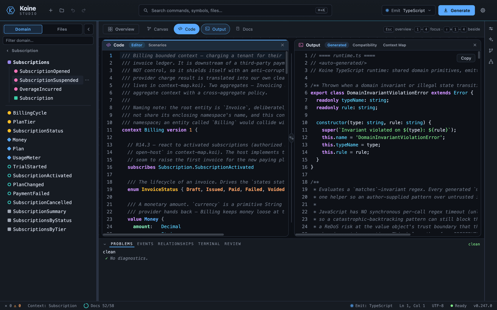
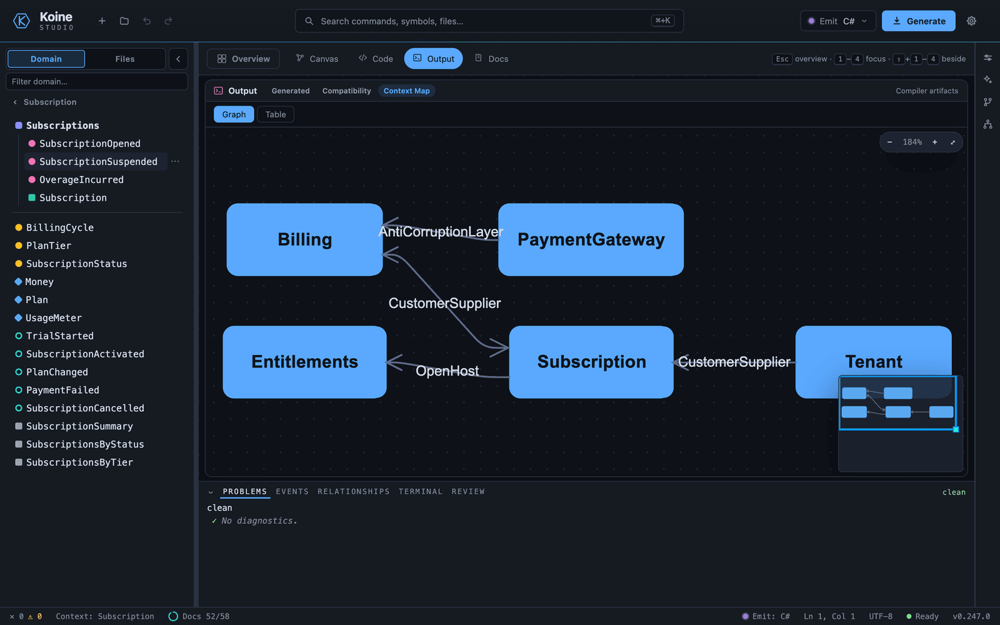
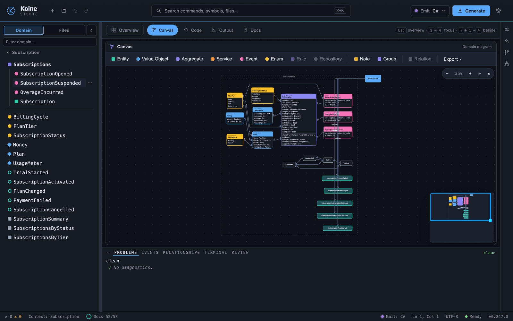
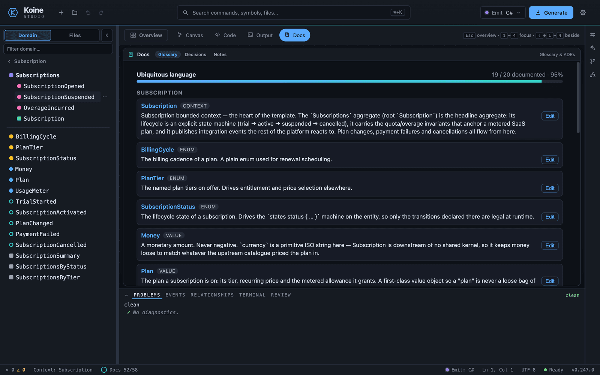
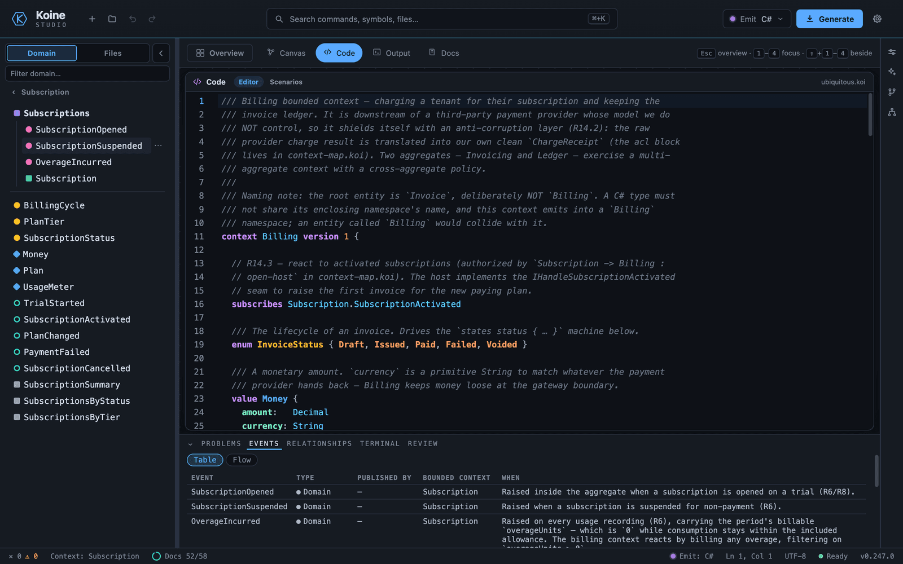

<p align="center">
  <!-- The Koine brand mark: a lowercase kappa (κ) inscribed in the ports-and-adapters hexagon.
       GitHub ignores @media inside a referenced SVG, so <picture> flips the variant by theme:
       the accent mark on a dark README, the ink mark on a light one. -->
  <picture>
    <source media="(prefers-color-scheme: dark)" srcset="assets/koine-mark.svg" />
    
  </picture>
</p>

<h1 align="center">Koine</h1>

<p align="center">
  <b>Write your domain's ubiquitous language once, in <code>.koi</code> files.</b><br />
  Koine compiles it to idiomatic, self-contained code — value objects, entities, aggregates,
  invariants, the whole Domain-Driven Design toolkit — in <b>7 languages</b>.
</p>

<p align="center">
  <a href="https://atypical-consulting.github.io/Koine/studio/"></a>
  <a href="https://atypical-consulting.github.io/Koine/"></a>
  <a href="https://www.nuget.org/packages/Koine.Cli"></a>
  <a href="https://www.nuget.org/packages/Koine.Cli"></a>
  <a href="https://github.com/Atypical-Consulting/Koine/actions/workflows/ci.yml"></a>
  <a href="https://dotnet.microsoft.com/"></a>
  <a href="https://github.com/Atypical-Consulting/Koine/commits/main"></a>
  <a href="LICENSE"></a>
</p>

<p align="center">
  
</p>

<p align="center">
  <a href="https://github.com/Atypical-Consulting/Koine/stargazers"></a>
</p>

<!-- Animated demo rendered from tooling/koine-demo (Remotion). Re-render with `npm run render:gif` there. -->
<p align="center">
  <a href="https://atypical-consulting.github.io/Koine/studio/">
    
  </a>
</p>

<p align="center">
  <em>25 lines of <code>.koi</code> → 11 files of idiomatic C# — every number in the loop is a real <code>koine build</code>. <a href="https://atypical-consulting.github.io/Koine/studio/">Try it in your browser, zero install</a>.</em>
</p>

## Table of Contents

- [The problem](#the-problem)
- [The solution](#the-solution)
- [Features](#features)
- [Try it in the browser](#try-it-in-the-browser)
- [A taste of the language](#a-taste-of-the-language)
- [Quick start (CLI)](#quick-start-cli)
- [The language](#the-language)
- [Architecture](#architecture)
- [Koine as a platform](#koine-as-a-platform)
- [Tooling](#tooling)
- [Koine in the AI workflow](#koine-in-the-ai-workflow)
- [Tech stack](#tech-stack)
- [Status and roadmap](#status-and-roadmap)
- [Templates](#templates)
- [Demo](#demo)
- [Contributing](#contributing)
- [License](#license)

## The problem

Domain-Driven Design gives you a precise vocabulary — value objects, entities, aggregates,
invariants, domain events, state machines — but in C# every one of those is a pile of mechanical
boilerplate: validating constructors, value equality, identity equality, defensive copies, guard
clauses, repository contracts. You write it by hand for every type. Then the model drifts from the
glossary on the wiki, the "ubiquitous language" stops being ubiquitous, and the rules you cared
about get buried in plumbing.

## The solution

**Koine is a small, readable DSL for DDD.** You describe a bounded context using the same words your
domain experts use, and the compiler emits the tactical code for you — correct, idiomatic, and with
no runtime to reference. The model *is* the ubiquitous language: there is no second copy to keep in
sync, and the rules stay front and center instead of drowning in boilerplate.

The name evokes **Koine Greek**, the *common* language that became a lingua franca. The goal is the
same: compile one domain model to many targets. The parser and semantic model are kept strictly
target-agnostic, so a new backend is a new project, not a rewrite. **C# is the primary and most
complete target**; the same model also compiles to six other languages and three spec/doc formats:

| Target | Flag | Notes |
|--------|------|-------|
| **C#** | `--target csharp` | Primary target — tactical + strategic core, with opt-in application & EF Core layers |
| **TypeScript** | `--target typescript` | `tsc --strict`-clean; tactical + CQRS, opt-in infrastructure layer |
| **Python** 3.11+ | `--target python` | Dependency-free, `mypy --strict`-clean; opt-in infrastructure layer |
| **PHP** 8.1 | `--target php` | Dependency-free; typed and readonly promoted properties |
| **Rust** | `--target rust` | Idiomatic crate, multi-context; `cargo build` verifies it compiles |
| **Java** 17 | `--target java` | stdlib-only records, sealed events; `javac` verifies |
| **Kotlin** 2.x | `--target kotlin` | Idiomatic Kotlin/JVM data classes; `kotlinc` verifies |
| **docs** | `--target docs` | Living documentation — Markdown + Mermaid diagrams |
| **AsyncAPI** 3.0 | `--target asyncapi` | Event-API document from the integration-event + context-map graph |
| **OpenAPI** 3.1 | `--target openapi` | REST contract per bounded context — schemas, paths, parameters |

Every target's output is mapped construct-by-construct in the
[feature catalogue](https://atypical-consulting.github.io/Koine/guides/feature-catalogue/).

## Features

- ✅ **One source of truth** — the model *is* the ubiquitous language; no drift between glossary and code.
- 🌍 **7 language targets from one model** — C#, TypeScript, Python, PHP, Rust, Java, and Kotlin.
- 📄 **3 spec/doc targets** — living docs (Markdown + Mermaid), AsyncAPI 3.0, and OpenAPI 3.1.
- 🧱 **The full DDD toolkit** — value objects, entities, aggregates, smart enums, invariants, commands,
  domain events, state machines, factories, specifications, services, policies, repositories,
  optimistic concurrency, the application/CQRS layer, context maps, integration events, and model versioning.
- 📦 **Dependency-free output** — generated code is plain, readable, and self-contained; nothing to install.
- ⚙️ **Runnable infrastructure, opt-in** — EF Core (C#) or dependency-light stores (TS/Python) via `--layers`.
- 🛡️ **Enforced DDD discipline** — reference rules are hard compiler errors (`KOI1601`–`KOI1605`), not lint.
- 🌐 **Runs in your browser** — the compiler is compiled to WebAssembly; Studio + Playground need zero install.
- 🔧 **First-class tooling** — a `koine lsp` language server, canonical formatter, an MCP server for AI
  agents, and a TextMate grammar for VS Code / Rider.
- ✔️ **A green build proves the domain** — every construct is snapshot-tested *and* compiled and executed
  through an in-memory Roslyn meta-test, so a passing build means the generated code is correct and usable.

<div align="right"><sub><a href="#table-of-contents">↑ Back to top</a></sub></div>

## Try it in the browser

The Koine compiler is itself compiled to WebAssembly, so you can write a model and watch it become
C# without installing anything.

- **[Koine Studio](https://atypical-consulting.github.io/Koine/studio/)** — the full web IDE, running
  the real compiler in your browser. *(Also ships as a native [Tauri](https://tauri.app/) desktop app —
  same UI, see [`tooling/koine-studio`](tooling/koine-studio).)*
- **[Playground](https://atypical-consulting.github.io/Koine/playground/)** — a lightweight,
  zero-install editor that recompiles to C#/TypeScript the moment you stop typing. Great for a quick
  taste or for following along with the [tutorial](https://atypical-consulting.github.io/Koine/start/your-first-model/).

> Both run the **same** parser, validator, and emitters as the `koine` CLI — what you see in the
> browser is exactly what the build produces.

<details>
<summary><b>🔍 Take the full IDE tour (6 views)</b></summary>

<br />

The hero above is the editor split — but Studio is a full IDE, and a single shot can't show it. Each
surface below is a click away in the [live Studio](https://atypical-consulting.github.io/Koine/studio/):

<table>
  <tr>
    <td width="50%" valign="top">
      <a href="https://atypical-consulting.github.io/Koine/studio/"></a>
      <br /><b>Emit-target switcher</b> — flip the <em>same</em> model between C#, TypeScript, Python, PHP, Rust, Java, and Kotlin output without leaving the page.
    </td>
    <td width="50%" valign="top">
      <a href="https://atypical-consulting.github.io/Koine/studio/"></a>
      <br /><b>Context-map graph</b> — an interactive graph of the bounded contexts and the relationships between them.
    </td>
  </tr>
  <tr>
    <td width="50%" valign="top">
      <a href="https://atypical-consulting.github.io/Koine/studio/"></a>
      <br /><b>Diagram views</b> — aggregates and state machines rendered as diagrams straight from the model.
    </td>
    <td width="50%" valign="top">
      <a href="https://atypical-consulting.github.io/Koine/studio/"></a>
      <br /><b>Ubiquitous-language glossary</b> — the generated glossary of every term in the domain, kept in lock-step with the model.
    </td>
  </tr>
  <tr>
    <td width="50%" valign="top">
      <a href="https://atypical-consulting.github.io/Koine/studio/"></a>
      <br /><b>Model outline &amp; panels</b> — a structural outline of the model plus a bottom <b>Events &amp; Relationships</b> panel.
    </td>
    <td width="50%" valign="top">
      <b>Editor &amp; live diagnostics</b> — your <code>.koi</code> model on the left, the emitted code on the right, with error squiggles and quick info as you type (the hero split above) — the same parser and validator the CLI runs.
      <br /><br />
      <b>Syntax tree</b> — the raw parse tree of the active file in the right rail: every node's kind, name, and source span, with error-recovery markers made visible. Click a node to jump the editor to it; move the caret to highlight the matching node.
    </td>
  </tr>
</table>

</details>

**Concept Colors** — *one DDD concept, one color, everywhere.* An aggregate is the same indigo, a
value object the same blue, an enum the same amber in the explorer, on the canvas, in the code editor,
in the playground, and in VS Code — driven by one palette and the language server's concept-kind
signal, so the association carries from the tree straight into the source. See the
[Concept Colors guide](https://atypical-consulting.github.io/Koine/guides/concept-colors/).

📖 **Full docs → <https://atypical-consulting.github.io/Koine/>** — getting started, a six-part
tutorial, the complete language reference, the feature catalogue, and the CLI. (Source in
[`website/`](website/); run locally with `cd website && npm install && npm run dev`.)

<div align="right"><sub><a href="#table-of-contents">↑ Back to top</a></sub></div>

## A taste of the language

A `.koi` file declares one or more bounded `context`s. Inside a context you declare value objects,
entities, aggregates, and enums:

```koine
context Billing {

  value Money {
    amount: Decimal
    currency: Currency
    invariant amount >= 0        "a monetary amount cannot be negative"
  }

  enum Currency { EUR, USD, GBP }

  value Email {
    raw: String
    invariant raw matches /^[^@]+@[^@]+$/   "invalid email address"
  }

  entity Customer identified by CustomerId {
    name: String
    email: Email
  }

  aggregate Order root Order {

    enum OrderStatus { Draft, Placed, Shipped, Cancelled }

    value OrderLine {
      product:   ProductId
      quantity:  Int
      unitPrice: Money
      subtotal:  Money = unitPrice * quantity     // derived (computed) field
    }

    entity Order identified by OrderId {
      customer: CustomerId
      lines:    List<OrderLine>
      status:   OrderStatus = Draft               // default value
      invariant status == Draft when lines.isEmpty
    }
  }
}
```

That compiles to plain C# records and classes with validating constructors, value/identity equality,
a generated `OrderId`/`CustomerId`, an `IOrderRepository` contract, and the `Money * int` operator
needed for `subtotal` — nothing for you to write, and nothing external to reference.

<div align="right"><sub><a href="#table-of-contents">↑ Back to top</a></sub></div>

## Quick start (CLI)

Requires **.NET 10**.

Install the CLI as a .NET global tool from NuGet, then invoke it as `koine`:

```bash
dotnet tool install --global Koine.Cli
koine --version
koine build templates/starters/billing/billing.koi --target csharp --out ./generated
```

Or run it **without installing** via [`dnx`](https://learn.microsoft.com/dotnet/core/tools/dotnet-dnx)
(bundled with the .NET 10 SDK — it fetches the tool from NuGet and runs it in one shot, like `npx`):

```bash
dnx Koine.Cli build templates/starters/billing/billing.koi --target csharp --out ./generated
```

Or run it straight from a clone of this repo with `dotnet run --project src/Koine.Cli -- …`:

```bash
# Build everything and run the tests
./scripts/build/build.sh         # or: dotnet build && dotnet test

# Compile a model to C# — swap --target for any target in the table above
dotnet run --project src/Koine.Cli -- build templates/starters/billing/billing.koi --target csharp --out ./generated

# Add a runnable infrastructure layer — EF Core for C#, dependency-light for TypeScript/Python
dotnet run --project src/Koine.Cli -- build templates/starters/billing/billing.koi --target csharp --out ./generated --layers domain,infrastructure

# Add the opt-in C# Application layer (command/factory handlers, validators, query handlers, DI)
dotnet run --project src/Koine.Cli -- build templates/starters/billing/billing.koi --target csharp --out ./generated --layers domain,application

# Spec/doc targets: living docs, an AsyncAPI 3.0 event API, an OpenAPI 3.1 REST contract
dotnet run --project src/Koine.Cli -- build templates/starters/billing/billing.koi --target docs --out ./docs
dotnet run --project src/Koine.Cli -- build templates/pizzeria --target asyncapi --out ./events

# Just check a model parses & validates (no output), or print the version
dotnet run --project src/Koine.Cli -- build templates/starters/billing/billing.koi
dotnet run --project src/Koine.Cli -- --version
```

The generated C# in `./generated` is self-contained and compiles on its own. A path argument may be a
single `.koi` file **or a directory** — directory mode compiles every `.koi` underneath as one model,
so cross-file imports, context maps, and integration events resolve.

Other CLI commands: `check` (model-versioning compatibility against a `--baseline`), `coverage` (proves
*declared == emitted* and doubles as a CI gate), `fmt` (canonical formatter), `init` (scaffold a
project), `watch` (rebuild on change), `lsp` (language server over stdio), and `mcp` (the MCP server —
stdio by default, or `--http` to serve it over HTTP). See the
[CLI reference](https://atypical-consulting.github.io/Koine/guides/cli/).

<details>
<summary><b>C# layers (<code>--layers</code>): domain contracts + opt-in EF Core infrastructure</b></summary>

<br />

The C# target emits in composable **layers**, selected with `--layers` (or `targets.csharp.layers` in
`koine.config`):

| Layer | What it emits |
| --- | --- |
| `domain` *(default)* | The Domain model + the application/CQRS **contracts** — value objects, entities, aggregates, invariants, smart enums, events, the persistence-ignorant `IRepository`/`IUnitOfWork` interfaces, etc. Byte-identical to the historical output. |
| `infrastructure` | A runnable **EF Core** realization of those contracts, per bounded context: a `DbContext` with a `DbSet` per aggregate root, `IEntityTypeConfiguration` mappings (value objects → owned types, the `versioned` token → `IsRowVersion`, smart enums → `HasConversion`, strongly-typed IDs → key converters), a concrete `Repository` + `UnitOfWork`, a transactional `OutboxMessage` + `IntegrationEventDispatcher` (for a publishing context), and an `Add<Context>Infrastructure(this IServiceCollection, Action<DbContextOptionsBuilder>)` DI extension. Implies `domain`. |

```bash
# Domain contracts only (default — omit --layers for the same result)
koine build ./Models --target csharp --out ./generated --layers domain

# Domain + a regenerated EF Core infrastructure layer
koine build ./Models --target csharp --out ./generated --layers domain,infrastructure
```

The infrastructure is **regenerated from the model on every build**, so it can never silently drift
from the ubiquitous language. The provider (SQL Server, Postgres, …) is supplied by the caller through
the `Action<DbContextOptionsBuilder>`, so the emitter stays provider-agnostic. EF Core only in v1.

The C# EF Core mappings are exercised end-to-end: every persisted aggregate round-trips — scalar-only
roots, owned scalar value objects, versioned aggregates, nested value objects, and value-object
collections all insert and re-query correctly.

</details>

<details>
<summary><b>TypeScript &amp; Python infrastructure (<code>--layers infrastructure</code>)</b></summary>

<br />

The same `--layers infrastructure` selector now applies to the **TypeScript** and **Python** targets
(issue #241), keeping the "write the ubiquitous language once, get a runnable stack" promise across all
three primary targets. Rather than a bundled ORM, each emits a **dependency-light** realization of the
domain contracts, per bounded context with at least one entity-rooted aggregate:

- a concrete repository over an **injectable `AggregateStore`** with a zero-dependency **in-memory
  default** (runnable in tests out of the box; swap in a persistent store to productionize) — declarative
  finders compile to concrete lookups;
- a concrete **unit of work** realizing the per-context contract;
- a **transactional outbox** (`OutboxMessage` + a drainable `IntegrationEventDispatcher`) for a publishing
  context, so the publisher stays decoupled from its subscribers;
- **validation + transaction pipeline behaviors** (the idiomatic analogue of the C# MediatR decorators); and
- a **composition-root factory** (TypeScript) / **provider helper** (Python) — the analogue of C#'s
  `Add<Context>Infrastructure`.

The shared primitives live once in an emitted `infrastructure-runtime.ts` / `koine_infrastructure.py`.
The layer is **off by default**, so an unconfigured emit is byte-identical to the historical output; the
generated TypeScript is `tsc --strict`-clean and the Python is `mypy --strict`-clean.

</details>

<details>
<summary><b>The C# Application layer (opt-in <code>--layers domain,application</code>)</b></summary>

<br />

By default `--target csharp` stops at the **application boundary**: it emits the *contracts* —
`IUnitOfWork`, the `I<Service>` use-case interfaces, read-model projections, query objects and the
`IQueryHandler<,>` runtime type — but no implementations. Pass `--layers domain,application` to also
emit the **Application layer** that fills those in:

| Construct | Emitted application code |
|-----------|--------------------------|
| aggregate **command** | a `<Entity><Command>Request` record + a handler that loads the aggregate via its `IUnitOfWork` repository, invokes the behavior, and `SaveChangesAsync`. |
| aggregate **factory** | a `<Entity><Factory>Request` record + a handler that creates the aggregate, adds it via the repository, and commits. |
| value-object / command **invariant** | a FluentValidation `AbstractValidator<TRequest>` rule (`RuleFor(...).Must(...).WithMessage(...)`) rendered from the same invariant the domain enforces — not re-derived by hand. |
| **query** | a concrete `IQueryHandler<,>`; a single result keyed by the root's identity loads + projects via the `To<ReadModel>` mapper, other shapes throw until wired to your read store. |
| **DI** | an `Add<Context>Application(this IServiceCollection)` extension registering every handler, validator and query handler. |

Plain handlers (no third-party runtime dependency beyond FluentValidation) are the **default**.
Two opt-in sub-options, also settable via `koine.config` (`targets.csharp.application.mediatr`,
`targets.csharp.application.mapping`):

- `--app-mediatr` — emit the **MediatR** shape instead: `IRequest`/`IRequest<T>` requests,
  `IRequestHandler<,>` handlers, and validation + transaction `IPipelineBehavior<,>`s.
- `--app-mapping plain|mapperly` — DTO/read-model mapping strategy (`plain` hand-rolled mappers by
  default; `mapperly` is reserved for source-generated mapping).

With the layer **off** (the default), the emitted C# is byte-identical to before. Koine `usecase`
declarations carry no binding to a specific aggregate behavior, so the generated `I<Service>`
implementation throws `NotImplementedException` until wired — the generated command/factory handlers
are the real entry points. `MediatR`/`FluentValidation`/`Mapperly` are C#-emitter concerns and never
leak into the target-agnostic model.

</details>

<div align="right"><sub><a href="#table-of-contents">↑ Back to top</a></sub></div>

## The language

A `.koi` model is built from a handful of declarations that map directly to DDD building blocks. The
core constructs and how they compile to C#:

<details>
<summary><b>Constructs → what they emit</b></summary>

<br />

| Construct | Emits |
|-----------|-------|
| `value X { … }` | `sealed record` with get-only properties, a validating constructor, value equality |
| `entity X identified by XId { … }` | `sealed class` with **identity-only** equality + a generated `XId` value object (Guid by default; `as natural(String\|Int)` or `as sequence` selects the strategy). A `create` factory either mints the id (Guid: `XId.New()` / `XId::generate()`) or, for a `natural`/`sequence` key, takes it as an explicit identity-typed parameter (`create register(id: XId, …)`) — `KOI0808` only when a non-Guid factory provides neither. |
| `aggregate A root R { … }` | nested types in the `<Context>` namespace; the root `R` implements `IAggregateRoot`, and an `I<R>Repository` contract is emitted for it |
| `aggregate A root R versioned { … }` | the root additionally gains a get-only `Version` token; `ConcurrencyConflictException` is emitted into `Koine.Runtime` |
| `repository { operations: … ; find name(p): List<R>\|R }` | tunes the root's repository — its mutating method set plus intention-revealing async finders |
| `service S { usecase U(p: T): R }` | an application-service interface `IS` with one async method per use case (`Task`/`Task<R>`); a context with aggregates also gets an `IUnitOfWork` |
| `readmodel M from Src { id; total: Int = … }` | a flat, value-equal DTO `record` + a static `ToM(this Src src)` projection mapper |
| `query Q(criteria): List<M>\|M` | a query DTO `record` handled via the shared generic `IQueryHandler<TQuery,TResult>` |
| `enum E { … }` | a self-contained **smart enum** (`sealed class`: static instances, `Name`/`Value`, `All`, `FromName`/`FromValue`, value equality, `==`/`!=`) |
| `name: Type` | a typed property + constructor parameter |
| `name: Type = const` | a constructor parameter with a default value |
| `name: Type = expr` (refs siblings) | a derived, get-only **computed** property (not in the constructor) |
| `invariant <expr> "msg"` | a constructor guard that throws `DomainInvariantViolationException` |
| `invariant <expr> matches /re/ …` | a regex guard (`Regex.IsMatch`) |
| `invariant <body> when <cond>` | a conditional guard (`if (cond && !body) throw`) |

The full construct set (commands, domain events, state machines, factories, specs, services,
policies, context maps, integration events, model versioning) is mapped construct-by-construct to the
C# it emits in the [**feature catalogue**](https://atypical-consulting.github.io/Koine/guides/feature-catalogue/).

</details>

<details>
<summary><b>Expression sublanguage &amp; primitive type mapping</b></summary>

<br />

**Expression sublanguage** — small and pure (no statements, no I/O): comparisons (`== != < <= > >=`),
arithmetic (`+ - * /`), logical (`&& || !`), member access (`lines.isEmpty`), regex `matches /…/`, a
`when` guard, identifiers, and literals.

**Primitive type mapping (Koine → C#):**

| Koine | C# | Notes |
|-------|----|-------|
| `String` | `string` | |
| `Int` | `int` | |
| `Decimal` | `decimal` | money / quantities |
| `Bool` | `bool` | |
| `Instant` | `DateTimeOffset` | |
| `List<T>` | `IReadOnlyList<T>` | defensively copied in the constructor |
| `<XId>` | generated ID value object | a `record` wrapping a `Guid` |

</details>

<details>
<summary><b>Current limitations</b></summary>

<br />

- **Soft keywords.** Most Koine keywords (`context`, `value`, `entity`, `aggregate`, `enum`, `command`,
  `service`, `policy`, `repository`, `readmodel`, `query`, `import`, `module`, …) may be used as field
  names, and declaration keywords additionally as type names and in expressions. Only `matches` and
  `invariant` remain reserved; keywords are *not* usable in the few hard-`Identifier` positions (a
  type/command/state/enum-member name). Because `<-` and `->` are atomic operators, a comparison against
  a negative operand needs a space (`x < -1`, not `x<-1`).
- **Reserved type names.** `List`, `Set`, `Map`, and `Range` are built-in generics; a user type may not
  take one of these names.

</details>

<div align="right"><sub><a href="#table-of-contents">↑ Back to top</a></sub></div>

## Architecture

The pipeline is strictly layered so backends are pluggable:

```
.koi source
  → Lexer/Parser (ANTLR, generated from Grammar/KoineLexer.g4 + KoineParser.g4)
  → KoineModelBuilderVisitor → semantic model (Ast/, target-agnostic)
  → SemanticValidator (Semantics/) → diagnostics with line/column
  → IEmitter (Koine.Emit.CSharp, .TypeScript, .Python, .Php, .Rust, …) → source files
```

The grammar is split into a separate **lexer grammar** so that `matches /regex/` can use a lexer mode —
this lets a regex literal be read as a single token without colliding with the `/` division operator.
The single most important invariant: **no C#-specific concept lives in `Ast/`** — that is what keeps
multiple emitters possible.

<details>
<summary><b>Project layout (<code>Koine.slnx</code>)</b></summary>

<br />

```
Koine.slnx
├── src/
│   ├── Koine.Compiler/          # parser, Ast/, semantics + emit CONTRACTS (IEmitter, EmitterRegistry, …)
│   │   ├── Grammar/             # KoineLexer.g4, KoineParser.g4
│   │   ├── Ast/                 # semantic model + ModelIndex (NO target-specific concepts)
│   │   ├── Parsing/             # KoineModelBuilderVisitor, SyntaxErrorListener
│   │   ├── Semantics/           # SemanticValidator (+ focused validators)
│   │   ├── Emit/                # IEmitter, IEmitterProvider, EmitterOptions, EmitterRegistry, EmitterLoader
│   │   ├── Diagnostics/         # Diagnostic
│   │   └── Services/            # KoineCompiler (orchestrator) + LSP/tooling backend
│   ├── Koine.Compiler.SourceGen/ # Roslyn source generator supporting the compiler
│   ├── Koine.Emit.Common/       # shared emitter helpers (FactoryIdBinding, MarkdownDoc, OperatorNeedsAnalyzer)
│   ├── Koine.Emit.CSharp/        # CSharpEmitter (primary target)  ── each emitter its own assembly (#861)
│   ├── Koine.Emit.TypeScript/    # TypeScriptEmitter
│   ├── Koine.Emit.Python/        # PythonEmitter (tactical core + strategic/CQRS layer)
│   ├── Koine.Emit.Php/           # PhpEmitter (tactical core + strategic/CQRS layer, PHP 8.1)
│   ├── Koine.Emit.Rust/          # RustEmitter (multi-context + CQRS read side)
│   ├── Koine.Emit.Java/          # JavaEmitter (stdlib-only records, sealed events; Java 17)
│   ├── Koine.Emit.Kotlin/        # KotlinEmitter (idiomatic Kotlin/JVM data classes; Kotlin 2.x)
│   ├── Koine.Emit.Glossary/      # ubiquitous-language glossary
│   ├── Koine.Emit.Docs/          # living documentation (Markdown + Mermaid diagrams)
│   ├── Koine.Emit.AsyncApi/      # AsyncApiEmitter (AsyncAPI 3.0 doc from integration events)
│   ├── Koine.Emit.OpenApi/       # OpenApiEmitter (OpenAPI 3.1 spec per bounded context)
│   ├── Koine.Emit.All/          # aggregator: BuiltInEmitterProviders.All — one reference, all targets
│   ├── Koine.Cli/               # `koine` command-line tool
│   ├── Koine.Wasm/              # the compiler as a WebAssembly module (Playground + Studio web)
│   └── Koine.Mcp/               # MCP server for AI agents
└── tests/
    └── Koine.Compiler.Tests/    # parsing, semantic, snapshot (Verify), Roslyn compile meta-tests
```

</details>

<details>
<summary><b>The browser bundle (AOT)</b></summary>

<br />

`Koine.Wasm` compiles the whole compiler to WebAssembly for the
[Playground](https://atypical-consulting.github.io/Koine/playground/) and
[Studio](https://atypical-consulting.github.io/Koine/studio/). The **deployed** bundle is
**AOT-compiled** (opt-in `KoineWasmAot` MSBuild property, switched on by the docs-deploy job) — roughly
5× faster per-keystroke compile in exchange for a larger one-time (browser-cached) download. A bare
`dotnet build`/`publish` and the dev inner loop stay on the fast interpreter build, so only the
deployed/CI path pays the slower AOT publish. Full rationale, measured trade-offs, and the mobile
fallback question live in the comment block in `src/Koine.Wasm/Koine.Wasm.csproj`
(issue [#327](https://github.com/Atypical-Consulting/Koine/issues/327)).

</details>

<div align="right"><sub><a href="#table-of-contents">↑ Back to top</a></sub></div>

## Koine as a platform

`Koine.Compiler` ships as a NuGet library with a **frozen, contract-gated public API** (guarded by
`Microsoft.CodeAnalysis.PublicApiAnalyzers`, so unintended public surface can never ship silently).
You can embed the compiler, write your own analyzers, and ship your own emitters.

<details>
<summary><b>Embed the compiler</b></summary>

<br />

`Koine.Compiler` carries the parser, semantic model, and emit **contracts**; the built-in emitters ship
in `Koine.Emit.All` (the `BuiltInEmitterProviders.All` aggregator). Add both to resolve a target like
`csharp`, then compile a model in process:

```bash
dotnet add package Koine.Compiler
dotnet add package Koine.Emit.All
```

```csharp
using Koine.Compiler;          // BuiltInEmitterProviders (from Koine.Emit.All)
using Koine.Compiler.Emit;     // EmitterRegistry, EmitterOptions, EmittedFile
using Koine.Compiler.Services; // KoineCompiler

var registry = new EmitterRegistry(BuiltInEmitterProviders.All);   // built-in providers (csharp, typescript, …)
registry.TryCreate("csharp", EmitterOptions.Empty, out var emitter);

var result = new KoineCompiler().Compile(source, emitter);  // string source or IReadOnlyList<SourceFile>
if (result.Success)
    foreach (EmittedFile file in result.Files)
        Console.WriteLine($"{file.RelativePath}\n{file.Contents}");
else
    foreach (var d in result.Diagnostics)
        Console.Error.WriteLine(d);
```

</details>

<details>
<summary><b>Write an analyzer</b></summary>

<br />

Implement `IModelAnalyzer` — a target-agnostic check over the resolved semantic model that reports
`Diagnostic`s:

```csharp
using Koine.Compiler.Diagnostics;
using Koine.Compiler.Semantics;

public sealed class NoLowercaseTypeNames : IModelAnalyzer
{
    public string Id => "acme.no-lowercase-type-names";

    public void Analyze(AnalyzerContext context)
    {
        foreach (var ctx in context.Model.Contexts)
            foreach (var type in ctx.Types)
                if (char.IsLower(type.Name[0]))
                    context.Report(Diagnostic.Warning("ACME001",
                        $"type '{type.Name}' should be PascalCase", type.Span));
    }
}
```

Wire it in code via `new KoineCompiler([new NoLowercaseTypeNames()])`, or let the CLI discover it:
point the `analyzers` key in `koine.config` at the assembly that contains it (a comma-separated list of
paths) — any public parameterless-constructible `IModelAnalyzer` is loaded and run after the built-ins.

```ini
# koine.config
analyzers = ./build/Acme.KoineAnalyzers.dll
```

</details>

<details>
<summary><b>Ship an emitter</b></summary>

<br />

Implement `IEmitterProvider` (returning an `IEmitter` for your target) to add a brand-new backend
without forking the compiler:

```csharp
using Koine.Compiler.Ast;
using Koine.Compiler.Emit;

public sealed class GoEmitterProvider : IEmitterProvider
{
    public string Target => "go";
    public IEmitter Create(EmitterOptions options) => new GoEmitter(options);
}

public sealed class GoEmitter : IEmitter
{
    public IReadOnlyList<EmittedFile> Emit(KoineModel model) => /* … */;
}
```

The CLI loads external emitters from the `emitters` key in `koine.config` (same discovery rules as
analyzers), so `koine build Models/ --target go` resolves your provider through the same
`EmitterRegistry` the built-in targets use.

```ini
# koine.config
emitters = ./build/Acme.GoEmitter.dll
```

</details>

<div align="right"><sub><a href="#table-of-contents">↑ Back to top</a></sub></div>

## Tooling

- **Web IDE.** [Koine Studio](https://atypical-consulting.github.io/Koine/studio/) and the
  [Playground](https://atypical-consulting.github.io/Koine/playground/) run the compiler in the
  browser (WebAssembly) — see [*Try it in the browser*](#try-it-in-the-browser) above. Studio also ships
  as a native desktop app ([`tooling/koine-studio`](tooling/koine-studio)). Its built-in **AI copilot**
  makes the `.koi` it generates valid by construction: a grammar-capable local model is constrained to
  Koine's grammar (GBNF token masking), hosted APIs fall back to bounded parse-and-repair against the
  real parser, and *Apply to editor* stays disabled until the model parses. In a folder workspace it
  can also **edit across files in one turn** — the assistant reads the workspace and *stages* full-file
  changes (new files land under the folder root) that you review as a per-file diff and apply together;
  nothing touches disk until you accept. See the
  [Assistant guide](https://atypical-consulting.github.io/Koine/guides/assistant-local-llm/).
- **Editor support.** [`tooling/koine-textmate`](tooling/) is a TextMate grammar for `.koi` that works
  in **JetBrains Rider** and **VS Code**. For **live error squiggles, completion, hover docs, and
  go-to-definition**, run the bundled language server (`koine lsp`) — it reuses the compiler's own
  parser + validator, so editor diagnostics match `koine build`, and hover/navigation resolve across
  every `.koi` file in the workspace. Setup in [`tooling/README.md`](tooling/README.md).
- **AI agents (MCP server).** [`src/Koine.Mcp`](src/Koine.Mcp) is an
  [MCP](https://modelcontextprotocol.io) server (`koine-mcp`) that lets an AI agent author a complete
  domain in `.koi`: tools to `koine_validate`, `koine_compile` (to any built-in target), and
  `koine_format`, plus `koine_reference` and `koine_examples` so the agent learns the language. Install
  with `dotnet tool install -g Koine.Mcp`, then register it over **stdio** (the default, for editor-spawned
  clients like Claude Desktop):

  ```json
  { "mcpServers": { "koine": { "command": "koine-mcp" } } }
  ```

  Or serve it over **HTTP** (Streamable HTTP/SSE) so any client connects by URL — no DLL paths.
  `koine mcp --http` (or `koine-mcp --http`) binds loopback on an OS-assigned port and prints the
  endpoint; an [LM Studio](https://lmstudio.ai) `mcp.json` then collapses to one line (use a
  tool-capable model):

  ```json
  { "mcpServers": { "koine": { "url": "http://127.0.0.1:PORT/mcp" } } }
  ```

  On the desktop, **Koine Studio** launches that HTTP server for you and shows the ready-to-paste
  `mcp.json` under **Settings → Assistant** (a "Copy mcp.json" button). From a checkout,
  `./scripts/install-mcp/install-mcp.sh` (or `.ps1` / `.cmd`) packs, installs, and registers the stdio
  server with **Claude Desktop** in one step. Full tool list + the HTTP recipe in the
  [MCP guide](https://atypical-consulting.github.io/Koine/guides/mcp-server/).

## Koine in the AI workflow

In spec-driven development, Koine is the **deterministic implementation step**. An AI agent authors a
small `.koi` model (over the MCP server above) and a human reviews *that model* — not thousands of
lines of generated code. From there, `koine build` compiles the reviewed spec to idiomatic C# with no
AI in the loop, so the implementation is a milliseconds-long, zero-token compile instead of a
generate-test-fix loop. Completeness isn't hoped-for: the compiler emits every declared type, and
`koine coverage` proves *declared == emitted* (exiting non-zero if anything is missing, so it doubles
as a CI gate). See the
[Model-as-spec guide](https://atypical-consulting.github.io/Koine/guides/model-as-spec/).

<div align="right"><sub><a href="#table-of-contents">↑ Back to top</a></sub></div>

## Tech stack

- .NET 10, C#
- ANTLR 4 via `Antlr4BuildTasks` + `Antlr4.Runtime.Standard` (visitor, not listener)
- Tests: xUnit, [Verify](https://github.com/VerifyTests/Verify) snapshots, and an in-memory **Roslyn**
  meta-test that compiles and executes the emitted C#.

## Status and roadmap

Koine ships the full tactical *and* strategic DDD toolkit and **nine emitter targets alongside C#** —
six languages (**TypeScript**, **Python**, **PHP 8.1**, **Rust**, **Java 17**, **Kotlin 2.x**) plus three
spec/doc targets (**docs** — Markdown + Mermaid, **AsyncAPI 3.0**, and **OpenAPI 3.1**) — the editor
tooling (TextMate grammar, `koine lsp` language server, and the `fmt` / `init` / `watch` commands), and
**model-as-spec coverage** (`koine coverage` proves declared == emitted and doubles as a CI gate, also
exposed as the `koine_coverage` MCP tool). The
[feature catalogue](https://atypical-consulting.github.io/Koine/guides/feature-catalogue/) maps every
construct to the C# it emits. The current version is shown by the NuGet badge above.

**Recently landed:** **Java 17** and **Kotlin 2.x** emitters (dependency-free, compile-verified via
`javac`/`kotlinc`); **DDD-kind metadata** surfaced across the TypeScript/Python/PHP emitters
([#1170](https://github.com/Atypical-Consulting/Koine/issues/1170)); and the CLI is now published to
**NuGet.org** via Trusted Publishing — `dotnet tool install --global Koine.Cli`
([#1179](https://github.com/Atypical-Consulting/Koine/pull/1179)). The full roadmap lives in
[`USER-STORIES.md`](USER-STORIES.md).

<div align="right"><sub><a href="#table-of-contents">↑ Back to top</a></sub></div>

## Templates

[`templates/`](templates/) is the **single, CI-validated source of truth** for Koine's example domains.
A *template* is a folder holding one or more `.koi` files plus a [`template.json`](templates/template.schema.json)
manifest describing it. Every template is compiled green and every manifest is schema-validated on each
build (`TemplatesValidationTests`), and the same set powers three places: the [demo](#demo) (below),
Koine Studio's **template gallery**, and the [Playground](https://atypical-consulting.github.io/Koine/playground/)
sample picker.

Templates come in four difficulty levels — **starter**, **beginner**, **intermediate**, **advanced** (the schema reserves all four; `beginner` is unused so far):

| Template | Difficulty | What it models |
|----------|-----------|----------------|
| [`starters/billing`](templates/starters/billing) | starter | Money, orders, and invariants — the canonical Koine starter |
| [`starters/ordering`](templates/starters/ordering) | starter | An aggregate with a state machine — renders as a diagram |
| [`starters/contextmap`](templates/starters/contextmap) | starter | Two bounded contexts and the relationship between them |
| [`starters/values`](templates/starters/values) | starter | Smart enums with data, quantities, ranges, and derived fields |
| [`ticketing`](templates/ticketing) | intermediate | A help-desk workflow with a ticket lifecycle and a cross-context SLA policy |
| [`pizzeria`](templates/pizzeria) | intermediate | A six-context pizza shop (menu, ordering, kitchen, delivery, payment, promotions) + an external Gateway |
| [`library`](templates/library) | intermediate | A lending library across five contexts — Book vs BookCopy, loans, reservations, fines |
| [`saas-subscription`](templates/saas-subscription) | advanced | Multi-tenant subscriptions with trials, metered quotas, dunning, and a payment-provider ACL |

<details>
<summary><b>The <code>template.json</code> manifest</b></summary>

<br />

Each template folder carries a `template.json` validated against
[`templates/template.schema.json`](templates/template.schema.json):

| Field | Meaning |
|-------|---------|
| `id` | Stable identifier — **must equal the folder name** |
| `name` | Human-readable display name |
| `tagline` | One-line summary shown in listings |
| `description` | A paragraph describing what the template models |
| `difficulty` | `starter` · `beginner` · `intermediate` · `advanced` — used to order and badge templates |
| `tags` | Free-form keywords for search and filtering |
| `contexts` | The bounded contexts the template defines |
| `coreAggregate` | The headline aggregate that anchors the template |
| `entryFile` | The primary `.koi` file to open first — **must name a file in the folder** |
| `teaches` | The Koine concepts / DDD patterns a learner picks up |
| `icon` | An icon identifier (emoji or icon name) for the template card |

</details>

<div align="right"><sub><a href="#table-of-contents">↑ Back to top</a></sub></div>

## Demo

[`demo/`](demo/) consumes the generated C# from a real .NET project. It compiles straight from the
**[`templates/pizzeria`](templates/pizzeria)** template — a pizzeria domain across **six bounded contexts**
(plus an external card Gateway) tied together by a context map — so `dotnet build demo/Pizzeria.Domain`
regenerates and compiles it, which makes building the demo the end-to-end proof that the pizzeria
template emits compiling, runnable C#. Between the `.koi` template and `Samples.cs` it exercises **the
full shipped feature set** — see [`demo/README.md`](demo/README.md) for the feature-to-location map.

## Contributing

Contributions are welcome! See [`CONTRIBUTING.md`](CONTRIBUTING.md) for how to build, test, and submit
a change, and please follow our [Code of Conduct](CODE_OF_CONDUCT.md). Security issues should be reported
privately — see [`SECURITY.md`](SECURITY.md). Notable changes are tracked in [`CHANGELOG.md`](CHANGELOG.md).

⭐ **If Koine is useful to you, a star helps others find it** — thank you!

## License

Koine is licensed under the **Apache License 2.0** — see [`LICENSE`](LICENSE). Copyright © 2026 Atypical
Consulting / Philippe Matray.

<div align="right"><sub><a href="#table-of-contents">↑ Back to top</a></sub></div>
