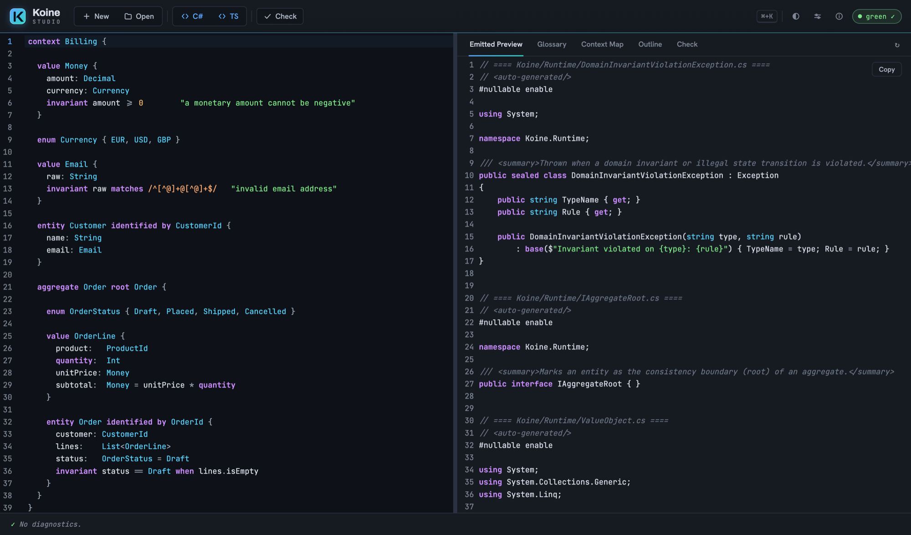

# Koine

> Write your domain's **ubiquitous language** once, in `.koi` files. Koine compiles it to
> idiomatic, self-contained C# — value objects, entities, aggregates, invariants, the whole
> Domain-Driven Design toolkit.

[](https://atypical-consulting.github.io/Koine/studio/)
[](https://atypical-consulting.github.io/Koine/)
[](https://dotnet.microsoft.com/)
[](tests/)

[](LICENSE)

## The problem

Domain-Driven Design gives you a precise vocabulary — value objects, entities, aggregates,
invariants, domain events, state machines — but in C# every one of those is a pile of mechanical
boilerplate: validating constructors, value equality, identity equality, defensive copies, guard
clauses, repository contracts. You write it by hand for every type. Then the model drifts from the
glossary on the wiki, the "ubiquitous language" stops being ubiquitous, and the rules you cared
about get buried in plumbing.

## The solution

**Koine is a small, readable DSL for DDD.** You describe a bounded context using the same words your
domain experts use, and the compiler emits the tactical code for you — correct, idiomatic, and with
no runtime to reference. The model *is* the ubiquitous language: there is no second copy to keep in
sync, and the rules stay front and centre instead of drowning in boilerplate.

The name evokes **Koine Greek**, the *common* language that became a lingua franca. The goal is to
compile one domain model to many targets. **C# is the primary, most complete target**; a
**TypeScript** emitter ships (`--target typescript`), a **Python** emitter ships (`--target python` →
dependency-free Python 3.11+, `mypy --strict`-clean; the tactical core *and* the strategic/CQRS layer
— read models, queries, policies, state machines, context maps/ACL), a **PHP 8.1**
emitter ships (`--target php` → dependency-free PHP 8.1, typed properties, readonly promoted properties; Phase 1
covers the tactical core), a **Rust** emitter ships (`--target rust` → an idiomatic crate: value
objects as structs with smart constructors returning `Result<_, DomainError>`, smart enums as Rust
`enum`s matched exhaustively, entities/aggregates with invariant-checked behaviors, events as a
`Vec`-friendly `DomainEvent` enum, and repositories as `trait`s; depends only on `rust_decimal` for
money and `regex` for `matches`; Phase 1 covers the tactical core), a **docs** target emits living
documentation (`--target docs` → Markdown + Mermaid diagrams) straight from the model, and the parser
and semantic model are kept strictly target-agnostic so further emitters can be added without touching them.

## See it run — in your browser

The Koine compiler is itself compiled to WebAssembly, so you can write a model and watch it become
C# without installing anything.

<p align="center">
  <a href="https://atypical-consulting.github.io/Koine/studio/">
    
  </a>
</p>

<p align="center">
  <em>Koine Studio — your <code>.koi</code> model (left) and the C# it compiles to (right), live in the browser.</em>
</p>

- **[Koine Studio](https://atypical-consulting.github.io/Koine/studio/)** — the full web IDE: editor
  with live diagnostics, an emitted-code preview (C# / TypeScript), the ubiquitous-language glossary,
  context map, and model outline. *(Also ships as a native [Tauri](https://tauri.app/) desktop app —
  same UI, see [`tooling/koine-studio`](tooling/koine-studio).)*
- **[Playground](https://atypical-consulting.github.io/Koine/playground/)** — a lightweight,
  zero-install editor that recompiles to C#/TypeScript the moment you stop typing. Great for a quick
  taste or for following along with the [tutorial](https://atypical-consulting.github.io/Koine/start/your-first-model/).

> Both run the **same** parser, validator, and emitters as the `koine` CLI — what you see in the
> browser is exactly what the build produces.

📖 **Full docs → <https://atypical-consulting.github.io/Koine/>** — getting started, a six-part
tutorial, the complete language reference, the feature catalogue, and the CLI. (Source in
[`website/`](website/); run locally with `cd website && npm install && npm run dev`.)

## A taste of the language

A `.koi` file declares one or more bounded `context`s. Inside a context you declare value objects,
entities, aggregates, and enums:

```koine
context Billing {

  value Money {
    amount: Decimal
    currency: Currency
    invariant amount >= 0        "a monetary amount cannot be negative"
  }

  enum Currency { EUR, USD, GBP }

  value Email {
    raw: String
    invariant raw matches /^[^@]+@[^@]+$/   "invalid email address"
  }

  entity Customer identified by CustomerId {
    name: String
    email: Email
  }

  aggregate Order root Order {

    enum OrderStatus { Draft, Placed, Shipped, Cancelled }

    value OrderLine {
      product:   ProductId
      quantity:  Int
      unitPrice: Money
      subtotal:  Money = unitPrice * quantity     // derived (computed) field
    }

    entity Order identified by OrderId {
      customer: CustomerId
      lines:    List<OrderLine>
      status:   OrderStatus = Draft               // default value
      invariant status == Draft when lines.isEmpty
    }
  }
}
```

That compiles to plain C# records and classes with validating constructors, value/identity equality,
a generated `OrderId`/`CustomerId`, an `IOrderRepository` contract, and the `Money * int` operator
needed for `subtotal` — nothing for you to write, and nothing external to reference.

## Why Koine?

- **One source of truth.** The model *is* the ubiquitous language — no drift between the glossary
  and the code.
- **Idiomatic, dependency-free output.** Generated C# is plain, readable, and self-contained; the
  `Koine.Runtime` markers are emitted alongside it, so there's nothing to install.
- **The whole tactical *and* strategic toolkit.** Value objects, entities, aggregates, smart enums,
  invariants, commands, domain events, state machines, factories, specifications, services,
  policies, repositories, optimistic concurrency, the application layer (UoW, read models, CQRS),
  multi-file modules, context maps, integration events, and model versioning — all shipped.
- **A green build proves the domain.** Every construct is snapshot-tested *and* compiled and executed
  through an in-memory Roslyn meta-test, so a passing build means the generated C# is correct and
  usable — not just that it parses.

## Quick start (CLI)

Requires **.NET 10**.

```bash
# Build everything and run the tests
./scripts/build/build.sh         # or: dotnet build && dotnet test

# Compile a domain model to C#
dotnet run --project src/Koine.Cli -- build templates/starters/billing/billing.koi --target csharp --out ./generated

# Add a runnable EF Core infrastructure layer (DbContext, repositories, unit of work, outbox, DI)
dotnet run --project src/Koine.Cli -- build templates/starters/billing/billing.koi --target csharp --out ./generated --layers domain,infrastructure

# Emit to TypeScript instead
dotnet run --project src/Koine.Cli -- build templates/starters/billing/billing.koi --target typescript --out ./generated

# Or to Python (tactical core + strategic/CQRS: read models, queries, policies, state machines, ACL)
dotnet run --project src/Koine.Cli -- build templates/starters/billing/billing.koi --target python --out ./generated_py

# Or to PHP 8.1 (Phase 1: tactical core — value objects, smart enums, entities, events, repositories)
dotnet run --project src/Koine.Cli -- build templates/starters/billing/billing.koi --target php --out ./generated_php

# Or to Rust (Phase 1: tactical core — an idiomatic crate; `cargo build` proves it compiles)
dotnet run --project src/Koine.Cli -- build templates/starters/billing/billing.koi --target rust --out ./generated_rs

# Emit the opt-in C# Application layer alongside the domain (handlers, validators, query handlers, DI)
dotnet run --project src/Koine.Cli -- build templates/starters/billing/billing.koi --target csharp --layers domain,application --out ./generated

# Generate living documentation (Markdown + Mermaid state/class/context-map diagrams)
dotnet run --project src/Koine.Cli -- build templates/starters/billing/billing.koi --target docs --out ./docs

# Just check a model parses & validates (no output)
dotnet run --project src/Koine.Cli -- build templates/starters/billing/billing.koi

# Version
dotnet run --project src/Koine.Cli -- --version
```

The generated C# in `./generated` is self-contained and compiles on its own. A path argument may be a
single `.koi` file **or a directory** — directory mode compiles every `.koi` underneath as one model,
so cross-file imports, context maps, and integration events resolve.

### C# layers (`--layers`)

The C# target emits in composable **layers**, selected with `--layers` (or `targets.csharp.layers` in
`koine.config`):

| Layer | What it emits |
| --- | --- |
| `domain` *(default)* | The Domain model + the application/CQRS **contracts** — value objects, entities, aggregates, invariants, smart enums, events, the persistence-ignorant `IRepository`/`IUnitOfWork` interfaces, etc. Byte-identical to the historical output. |
| `infrastructure` | A runnable **EF Core** realization of those contracts, per bounded context: a `DbContext` with a `DbSet` per aggregate root, `IEntityTypeConfiguration` mappings (value objects → owned types, the `versioned` token → `IsRowVersion`, smart enums → `HasConversion`, strongly-typed IDs → key converters), a concrete `Repository` + `UnitOfWork`, a transactional `OutboxMessage` + `IntegrationEventDispatcher` (for a publishing context), and an `Add<Context>Infrastructure(this IServiceCollection, Action<DbContextOptionsBuilder>)` DI extension. Implies `domain`. |

```bash
# Domain contracts only (default — omit --layers for the same result)
koine build ./Models --target csharp --out ./generated --layers domain

# Domain + a regenerated EF Core infrastructure layer
koine build ./Models --target csharp --out ./generated --layers domain,infrastructure
```

The infrastructure is **regenerated from the model on every build**, so it can never silently drift
from the ubiquitous language. The provider (SQL Server, Postgres, …) is supplied by the caller through
the `Action<DbContextOptionsBuilder>`, so the emitter stays provider-agnostic. EF Core only in v1.

> **Known limitation (v1):** a value-object **collection** (`list of <ValueObject>`) is mapped with EF
> Core `OwnsMany`, but Koine exposes such collections as a read-only `IReadOnlyList<T>`. Depending on the
> EF Core version, materializing an owned collection into a read-only navigation may need a mutable
> backing field — review the generated `OwnsMany` mapping for aggregates that carry value-object
> collections. Scalar (`String`/`Int`/…) collections are left to EF Core's primitive-collection convention.

Other CLI commands: `check` (model-versioning compatibility against a `--baseline`), `fmt` (canonical
formatter), `init` (scaffold a project), `watch` (rebuild on change), and `lsp` (language server over
stdio). See the [CLI reference](https://atypical-consulting.github.io/Koine/guides/cli/).

### The C# Application layer (opt-in)

By default `--target csharp` stops at the **application boundary**: it emits the *contracts* —
`IUnitOfWork`, the `I<Service>` use-case interfaces, read-model projections, query objects and the
`IQueryHandler<,>` runtime type — but no implementations. Pass `--layers domain,application` to also
emit the **Application layer** that fills those in:

| Construct | Emitted application code |
|-----------|--------------------------|
| aggregate **command** | a `<Entity><Command>Request` record + a handler that loads the aggregate via its `IUnitOfWork` repository, invokes the behavior, and `SaveChangesAsync`. |
| aggregate **factory** | a `<Entity><Factory>Request` record + a handler that creates the aggregate, adds it via the repository, and commits. |
| value-object / command **invariant** | a FluentValidation `AbstractValidator<TRequest>` rule (`RuleFor(...).Must(...).WithMessage(...)`) rendered from the same invariant the domain enforces — not re-derived by hand. |
| **query** | a concrete `IQueryHandler<,>`; a single result keyed by the root's identity loads + projects via the `To<ReadModel>` mapper, other shapes throw until wired to your read store. |
| **DI** | an `Add<Context>Application(this IServiceCollection)` extension registering every handler, validator and query handler. |

Plain handlers (no third-party runtime dependency beyond FluentValidation) are the **default**.
Two opt-in sub-options, also settable via `koine.config` (`targets.csharp.application.mediatr`,
`targets.csharp.application.mapping`):

- `--app-mediatr` — emit the **MediatR** shape instead: `IRequest`/`IRequest<T>` requests,
  `IRequestHandler<,>` handlers, and validation + transaction `IPipelineBehavior<,>`s.
- `--app-mapping plain|mapperly` — DTO/read-model mapping strategy (`plain` hand-rolled mappers by
  default; `mapperly` is reserved for source-generated mapping).

With the layer **off** (the default), the emitted C# is byte-identical to before. Koine `usecase`
declarations carry no binding to a specific aggregate behavior, so the generated `I<Service>`
implementation throws `NotImplementedException` until wired — the generated command/factory handlers
are the real entry points. `MediatR`/`FluentValidation`/`Mapperly` are C#-emitter concerns and never
leak into the target-agnostic model.

## The language

### Constructs

| Construct | Emits |
|-----------|-------|
| `value X { … }` | `sealed record` with get-only properties, a validating constructor, value equality |
| `entity X identified by XId { … }` | `sealed class` with **identity-only** equality + a generated `XId` value object (Guid by default; `as natural(String\|Int)` or `as sequence` selects the strategy) |
| `aggregate A root R { … }` | nested types in the `<Context>` namespace; the root `R` implements `IAggregateRoot`, and an `I<R>Repository` contract is emitted for it |
| `aggregate A root R versioned { … }` | the root additionally gains a get-only `Version` token; `ConcurrencyConflictException` is emitted into `Koine.Runtime` |
| `repository { operations: … ; find name(p): List<R>\|R }` | tunes the root's repository — its mutating method set plus intention-revealing async finders |
| `service S { usecase U(p: T): R }` | an application-service interface `IS` with one async method per use case (`Task`/`Task<R>`); a context with aggregates also gets an `IUnitOfWork` |
| `readmodel M from Src { id; total: Int = … }` | a flat, value-equal DTO `record` + a static `ToM(this Src src)` projection mapper |
| `query Q(criteria): List<M>\|M` | a query DTO `record` handled via the shared generic `IQueryHandler<TQuery,TResult>` |
| `enum E { … }` | a self-contained **smart enum** (`sealed class`: static instances, `Name`/`Value`, `All`, `FromName`/`FromValue`, value equality, `==`/`!=`) |
| `name: Type` | a typed property + constructor parameter |
| `name: Type = const` | a constructor parameter with a default value |
| `name: Type = expr` (refs siblings) | a derived, get-only **computed** property (not in the constructor) |
| `invariant <expr> "msg"` | a constructor guard that throws `DomainInvariantViolationException` |
| `invariant <expr> matches /re/ …` | a regex guard (`Regex.IsMatch`) |
| `invariant <body> when <cond>` | a conditional guard (`if (cond && !body) throw`) |

The full construct set (commands, domain events, state machines, factories, specs, services,
policies, context maps, integration events, model versioning) is mapped construct-by-construct to the
C# it emits in the [**feature catalogue**](https://atypical-consulting.github.io/Koine/guides/feature-catalogue/).

### Expression sublanguage

Small and pure (no statements, no I/O): comparisons (`== != < <= > >=`), arithmetic (`+ - * /`),
logical (`&& || !`), member access (`lines.isEmpty`), regex `matches /…/`, a `when` guard,
identifiers, and literals.

### Primitive type mapping (Koine → C#)

| Koine | C# | Notes |
|-------|----|-------|
| `String` | `string` | |
| `Int` | `int` | |
| `Decimal` | `decimal` | money / quantities |
| `Bool` | `bool` | |
| `Instant` | `DateTimeOffset` | |
| `List<T>` | `IReadOnlyList<T>` | defensively copied in the constructor |
| `<XId>` | generated ID value object | a `record` wrapping a `Guid` |

### Current limitations

- **Soft keywords.** Most Koine keywords (`context`, `value`, `entity`, `aggregate`, `enum`, `command`,
  `service`, `policy`, `repository`, `readmodel`, `query`, `import`, `module`, …) may be used as field
  names, and declaration keywords additionally as type names and in expressions. Only `matches` and
  `invariant` remain reserved; keywords are *not* usable in the few hard-`Identifier` positions (a
  type/command/state/enum-member name). Because `<-` and `->` are atomic operators, a comparison against
  a negative operand needs a space (`x < -1`, not `x<-1`).
- **Reserved type names.** `List`, `Set`, `Map`, and `Range` are built-in generics; a user type may not
  take one of these names.
- **Specs in service operations.** A `spec` referenced from inside a `service` operation body is not yet
  supported.

## Architecture

The pipeline is strictly layered so backends are pluggable:

```
.koi source
  → Lexer/Parser (ANTLR, generated from Grammar/KoineLexer.g4 + KoineParser.g4)
  → KoineModelBuilderVisitor → semantic model (Ast/, target-agnostic)
  → SemanticValidator (Semantics/) → diagnostics with line/column
  → IEmitter (Emit/CSharp, Emit/TypeScript, Emit/Python, Emit/Php, Emit/Rust, …) → source files
```

```
Koine.slnx
├── src/
│   ├── Koine.Compiler/
│   │   ├── Grammar/        # KoineLexer.g4, KoineParser.g4
│   │   ├── Ast/            # semantic model + ModelIndex (NO target-specific concepts)
│   │   ├── Parsing/        # KoineModelBuilderVisitor, SyntaxErrorListener
│   │   ├── Semantics/      # SemanticValidator (+ focused validators)
│   │   ├── Emit/           # IEmitter + EmittedFile
│   │   │   ├── CSharp/     # CSharpEmitter (primary target)
│   │   │   ├── TypeScript/ # TypeScriptEmitter
│   │   │   ├── Python/     # PythonEmitter (tactical core + strategic/CQRS layer)
│   │   │   ├── Php/        # PhpEmitter (Phase 1: tactical core, PHP 8.1)
│   │   │   ├── Rust/       # RustEmitter (Phase 1: tactical core)
│   │   │   ├── Glossary/   # ubiquitous-language glossary
│   │   │   └── Docs/       # living documentation (Markdown + Mermaid diagrams)
│   │   ├── Diagnostics/    # Diagnostic
│   │   └── Services/       # KoineCompiler (orchestrator) + LSP/tooling backend
│   ├── Koine.Cli/          # `koine` command-line tool
│   ├── Koine.Wasm/         # the compiler as a WebAssembly module (Playground + Studio web)
│   └── Koine.Mcp/          # MCP server for AI agents
└── tests/
    └── Koine.Compiler.Tests/   # parsing, semantic, snapshot (Verify), Roslyn compile meta-tests
```

The grammar is split into a separate **lexer grammar** so that `matches /regex/` can use a lexer mode —
this lets a regex literal be read as a single token without colliding with the `/` division operator.
The single most important invariant: **no C#-specific concept lives in `Ast/`** — that is what keeps
multiple emitters possible.

## Koine as a platform

`Koine.Compiler` ships as a NuGet library with a **frozen, contract-gated public API** (guarded by
`Microsoft.CodeAnalysis.PublicApiAnalyzers`, so unintended public surface can never ship silently).
You can embed the compiler, write your own analyzers, and ship your own emitters.

**Embed the compiler.** Reference the package and compile a model in process:

```bash
dotnet add package Koine.Compiler
```

```csharp
using Koine.Compiler.Emit;
using Koine.Compiler.Services;

var registry = new EmitterRegistry();                       // built-in providers (csharp, typescript, …)
registry.TryCreate("csharp", EmitterOptions.Empty, out var emitter);

var result = new KoineCompiler().Compile(source, emitter);  // string source or IReadOnlyList<SourceFile>
if (result.Success)
    foreach (EmittedFile file in result.Files)
        Console.WriteLine($"{file.RelativePath}\n{file.Contents}");
else
    foreach (var d in result.Diagnostics)
        Console.Error.WriteLine(d);
```

**Write an analyzer.** Implement `IModelAnalyzer` — a target-agnostic check over the resolved
semantic model that reports `Diagnostic`s:

```csharp
using Koine.Compiler.Diagnostics;
using Koine.Compiler.Semantics;

public sealed class NoLowercaseTypeNames : IModelAnalyzer
{
    public string Id => "acme.no-lowercase-type-names";

    public void Analyze(AnalyzerContext context)
    {
        foreach (var ctx in context.Model.Contexts)
            foreach (var type in ctx.Types)
                if (char.IsLower(type.Name[0]))
                    context.Report(Diagnostic.Warning("ACME001",
                        $"type '{type.Name}' should be PascalCase", type.Span));
    }
}
```

Wire it in code via `new KoineCompiler([new NoLowercaseTypeNames()])`, or let the CLI discover it:
point the `analyzers` key in `koine.config` at the assembly that contains it (a comma-separated list of
paths) — any public parameterless-constructible `IModelAnalyzer` is loaded and run after the built-ins.

```ini
# koine.config
analyzers = ./build/Acme.KoineAnalyzers.dll
```

**Ship an emitter.** Implement `IEmitterProvider` (returning an `IEmitter` for your target) to add a
brand-new backend without forking the compiler:

```csharp
using Koine.Compiler.Ast;
using Koine.Compiler.Emit;

public sealed class GoEmitterProvider : IEmitterProvider
{
    public string Target => "go";
    public IEmitter Create(EmitterOptions options) => new GoEmitter(options);
}

public sealed class GoEmitter : IEmitter
{
    public IReadOnlyList<EmittedFile> Emit(KoineModel model) => /* … */;
}
```

The CLI loads external emitters from the `emitters` key in `koine.config` (same discovery rules as
analyzers), so `koine build Models/ --target go` resolves your provider through the same
`EmitterRegistry` the built-in targets use.

```ini
# koine.config
emitters = ./build/Acme.GoEmitter.dll
```

## Tooling

- **Web IDE.** [Koine Studio](https://atypical-consulting.github.io/Koine/studio/) and the
  [Playground](https://atypical-consulting.github.io/Koine/playground/) run the compiler in the
  browser (WebAssembly) — see [*See it run*](#see-it-run--in-your-browser) above. Studio also ships as
  a native desktop app ([`tooling/koine-studio`](tooling/koine-studio)).
- **Editor support.** [`tooling/koine-textmate`](tooling/) is a TextMate grammar for `.koi` that works
  in **JetBrains Rider** and **VS Code**. For **live error squiggles, completion, hover docs, and
  go-to-definition**, run the bundled language server (`koine lsp`) — it reuses the compiler's own
  parser + validator, so editor diagnostics match `koine build`, and hover/navigation resolve across
  every `.koi` file in the workspace. Setup in [`tooling/README.md`](tooling/README.md).
- **AI agents (MCP server).** [`src/Koine.Mcp`](src/Koine.Mcp) is an
  [MCP](https://modelcontextprotocol.io) server (`koine-mcp`) that lets an AI agent author a complete
  domain in `.koi`: tools to `koine_validate`, `koine_compile` (csharp/typescript/python/php/glossary/docs), and
  `koine_format`, plus `koine_reference` and `koine_examples` so the agent learns the language. Install
  with `dotnet tool install -g Koine.Mcp`, then register it over **stdio** (the default, for editor-spawned
  clients like Claude Desktop):

  ```json
  { "mcpServers": { "koine": { "command": "koine-mcp" } } }
  ```

  Or serve it over **HTTP** (Streamable HTTP/SSE) so any client connects by URL — no DLL paths.
  `koine mcp --http` (or `koine-mcp --http`) binds loopback on an OS-assigned port and prints the
  endpoint; an [LM Studio](https://lmstudio.ai) `mcp.json` then collapses to one line (use a
  tool-capable model):

  ```json
  { "mcpServers": { "koine": { "url": "http://127.0.0.1:PORT/mcp" } } }
  ```

  On the desktop, **Koine Studio** launches that HTTP server for you and shows the ready-to-paste
  `mcp.json` under **Settings → Assistant** (a "Copy mcp.json" button). From a checkout,
  `./scripts/install-mcp/install-mcp.sh` (or `.ps1` / `.cmd`) packs, installs, and registers the stdio
  server with **Claude Desktop** in one step. Full tool list + the HTTP recipe in the
  [MCP guide](https://atypical-consulting.github.io/Koine/guides/mcp-server/).

### Koine in the AI workflow

In spec-driven development, Koine is the **deterministic implementation step**. An AI agent authors a
small `.koi` model (over the MCP server above) and a human reviews *that model* — not thousands of
lines of generated code. From there, `koine build` compiles the reviewed spec to idiomatic C# with no
AI in the loop, so the implementation is a milliseconds-long, zero-token compile instead of a
generate-test-fix loop. Completeness isn't hoped-for: the compiler emits every declared type, and
`koine coverage` proves *declared == emitted* (exiting non-zero if anything is missing, so it doubles
as a CI gate). See the
[Model-as-spec guide](https://atypical-consulting.github.io/Koine/guides/model-as-spec/).

## Tech stack

- .NET 10, C#
- ANTLR 4 via `Antlr4BuildTasks` + `Antlr4.Runtime.Standard` (visitor, not listener)
- Tests: xUnit, [Verify](https://github.com/VerifyTests/Verify) snapshots, and an in-memory **Roslyn**
  meta-test that compiles and executes the emitted C#.

## Status & roadmap

Koine is at **v0.17.x** and has shipped through **R1–R18** of the roadmap: the full tactical *and*
strategic DDD toolkit, four more emitter targets (**TypeScript**, **Python**, **PHP 8.1**, and
**Rust** — the latter three Phase 1: tactical core) alongside C#, a **docs** target that emits living
documentation (Markdown + Mermaid diagrams), the editor tooling (TextMate grammar,
`koine lsp` language server, and the `fmt` / `init` / `watch` commands), and **model-as-spec
coverage** (`koine coverage` proves declared == emitted and doubles as a CI gate, also exposed as the
`koine_coverage` MCP tool). The
[feature catalogue](https://atypical-consulting.github.io/Koine/guides/feature-catalogue/) maps every
construct to the C# it emits.

**Next up:** rounding out the newer targets — **Rust Phase 2**
([#173](https://github.com/Atypical-Consulting/Koine/issues/173)) takes the Rust emitter beyond the
tactical core to cross-context references and the remaining constructs. The full roadmap lives in
[`USER-STORIES.md`](USER-STORIES.md).

## Templates

[`templates/`](templates/) is the **single, CI-validated source of truth** for Koine's example domains.
A *template* is a folder holding one or more `.koi` files plus a [`template.json`](templates/template.schema.json)
manifest describing it. Every template is compiled green and every manifest is schema-validated on each
build (`TemplatesValidationTests`), and the same set powers three places: the [demo](#demo) (below),
Koine Studio's **template gallery**, and the [Playground](https://atypical-consulting.github.io/Koine/playground/)
sample picker.

Templates come in four difficulty levels — **starter**, **beginner**, **intermediate**, **advanced** (the schema reserves all four; `beginner` is unused so far):

| Template | Difficulty | What it models |
|----------|-----------|----------------|
| [`starters/billing`](templates/starters/billing) | starter | Money, orders, and invariants — the canonical Koine starter |
| [`starters/ordering`](templates/starters/ordering) | starter | An aggregate with a state machine — renders as a diagram |
| [`starters/contextmap`](templates/starters/contextmap) | starter | Two bounded contexts and the relationship between them |
| [`starters/values`](templates/starters/values) | starter | Smart enums with data, quantities, ranges, and derived fields |
| [`ticketing`](templates/ticketing) | intermediate | A help-desk workflow with a ticket lifecycle and a cross-context SLA policy |
| [`pizzeria`](templates/pizzeria) | intermediate | A six-context pizza shop (menu, ordering, kitchen, delivery, payment, promotions) + an external Gateway |
| [`library`](templates/library) | intermediate | A lending library across five contexts — Book vs BookCopy, loans, reservations, fines |
| [`saas-subscription`](templates/saas-subscription) | advanced | Multi-tenant subscriptions with trials, metered quotas, dunning, and a payment-provider ACL |

### The `template.json` manifest

Each template folder carries a `template.json` validated against
[`templates/template.schema.json`](templates/template.schema.json):

| Field | Meaning |
|-------|---------|
| `id` | Stable identifier — **must equal the folder name** |
| `name` | Human-readable display name |
| `tagline` | One-line summary shown in listings |
| `description` | A paragraph describing what the template models |
| `difficulty` | `starter` · `beginner` · `intermediate` · `advanced` — used to order and badge templates |
| `tags` | Free-form keywords for search and filtering |
| `contexts` | The bounded contexts the template defines |
| `coreAggregate` | The headline aggregate that anchors the template |
| `entryFile` | The primary `.koi` file to open first — **must name a file in the folder** |
| `teaches` | The Koine concepts / DDD patterns a learner picks up |
| `icon` | An icon identifier (emoji or icon name) for the template card |

## Demo

[`demo/`](demo/) consumes the generated C# from a real .NET project. It compiles straight from the
**[`templates/pizzeria`](templates/pizzeria)** template — a pizzeria domain across **six bounded contexts**
(plus an external card Gateway) tied together by a context map — so `dotnet build demo/Pizzeria.Domain`
regenerates and compiles it, which makes building the demo the end-to-end proof that the pizzeria
template emits compiling, runnable C#. Between the `.koi` template and `Samples.cs` it exercises **the
full shipped feature set** — see [`demo/README.md`](demo/README.md) for the feature-to-location map.

## Contributing

Contributions are welcome! See [`CONTRIBUTING.md`](CONTRIBUTING.md) for how to build, test, and submit
a change, and please follow our [Code of Conduct](CODE_OF_CONDUCT.md). Security issues should be reported
privately — see [`SECURITY.md`](SECURITY.md). Notable changes are tracked in [`CHANGELOG.md`](CHANGELOG.md).

## License

Koine is licensed under the **Apache License 2.0** — see [`LICENSE`](LICENSE). Copyright © 2026 Atypical
Consulting / Philippe Matray.
