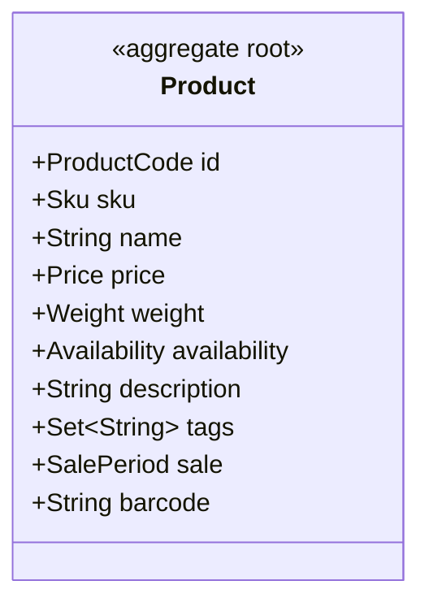

# Catalog — version 2

## Aggregates

### ProductCatalog

**Root entity:** `Product` (identified by `ProductCode`)

## Domain Types

### Sku — value object

| Field | Type | Description |
| --- | --- | --- |
| code | `String` |  |
| normalized | `String` | _derived_ |

**Business rules**
- a SKU cannot be blank
- SKU must look like ABC-1234

### Price — value object

| Field | Type | Description |
| --- | --- | --- |
| amount | `Decimal` |  |
| currency | `Currency` |  |

**Business rules**
- a price cannot be negative

### Weight — quantity

| Field | Type | Description |
| --- | --- | --- |
| amount | `Decimal` |  |
| unit | `MassUnit` |  |

**Business rules**
- a weight cannot be negative

### SalePeriod — value object

| Field | Type | Description |
| --- | --- | --- |
| window | `Range<Instant>` |  |

### Currency — enum

Values: EUR("€", 2), USD("$", 2), GBP("£", 2)

### MassUnit — enum

Values: Gram, Kilogram

### Availability — enum

Values: InStock, OutOfStock, Discontinued
