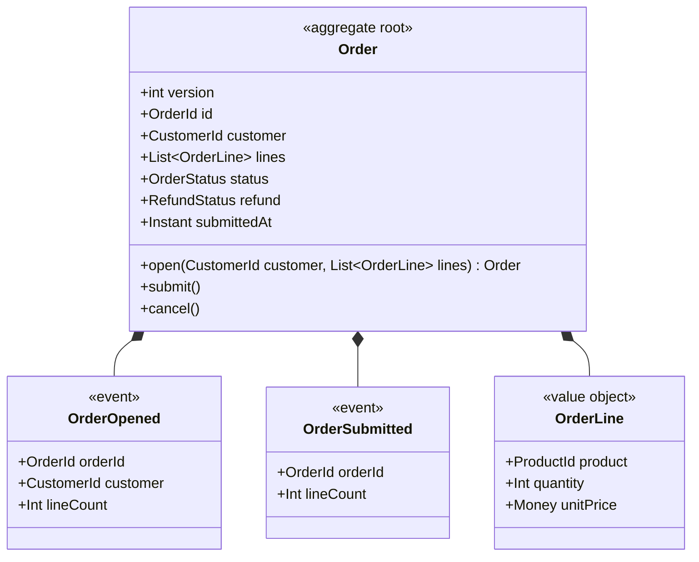
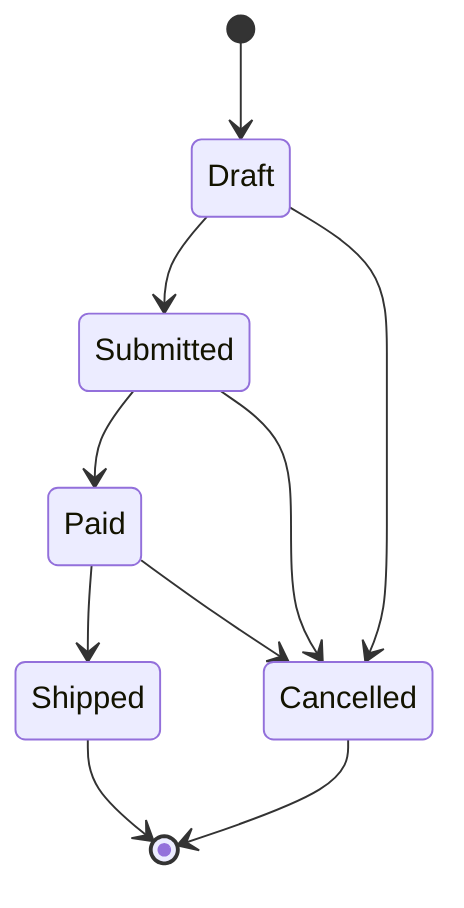

# Ordering — version 1

Ordering bounded context — placing and pricing customer orders.

## Aggregates

### Order _(versioned)_

The order aggregate. `versioned` adds an optimistic-concurrency token (R11.4); the `repository` block tunes the mutating set and adds intention-revealing finders (R11.3); being an aggregate it also joins the context `IUnitOfWork`.

**Root entity:** `Order` (identified by `OrderId`)

**Repository finders:**
- `byCustomer(customer: CustomerId): List<Order>`
- `mostRecent(customer: CustomerId): Order`

**Repository operations:** `getById`, `add`, `update`

#### Value Objects

**`OrderLine`**

One line of an order: a product, a quantity, and a unit price.

| Field | Type | Description |
| --- | --- | --- |
| product | `ProductId` |  |
| quantity | `Int` | How many units of the product. At least one. |
| unitPrice | `Money` |  |
| lineTotal | `Money` | _derived_ |
| payable | `Money` | _derived_ — What the customer actually pays for this line (10% off at 10+ units). |

**Business rules**
- an order line needs at least one unit

#### Domain Events

**`OrderOpened`**

Raised when an order is opened by the factory (R6/R8).

| Field | Type | Description |
| --- | --- | --- |
| orderId | `OrderId` |  |
| customer | `CustomerId` |  |
| lineCount | `Int` |  |

**`OrderSubmitted`**

Raised when an order is submitted for processing (R6).

| Field | Type | Description |
| --- | --- | --- |
| orderId | `OrderId` |  |
| lineCount | `Int` |  |

#### Lifecycle

| From | To | Guard |
| --- | --- | --- |
| `Draft` | `Submitted` |  |
| `Draft` | `Cancelled` |  |
| `Submitted` | `Paid` |  |
| `Submitted` | `Cancelled` |  |
| `Paid` | `Shipped` |  |
| `Paid` | `Cancelled` |  |
| `Shipped` | _(terminal)_ | |
| `Cancelled` | _(terminal)_ | |

#### Commands

##### `submit()`

Submit a drafted order for processing, stamping the time (R5) and recording a domain event (R6).

**Preconditions:**
- only a draft order can be submitted
- cannot submit an empty order

**Effects:**
- `status -> Submitted`
- `submittedAt -> now`

**Events:**
- `OrderSubmitted(orderId: id, lineCount: lines.count)`

##### `cancel()`

Cancel an order that has not yet shipped.

**Preconditions:**
- a shipped order cannot be cancelled

**Effects:**
- `status -> Cancelled`

#### Factory Operations

##### `open(customer: CustomerId, lines: List<OrderLine>)`

R8 — factory-only creation: open a draft order for a customer. The presence of any `create` makes the all-args constructor private, so callers must go through `Order.Open(...)`.

**Preconditions:**
- cannot open an empty order

**Events:**
- `OrderOpened(orderId: id, customer: customer, lineCount: lines.count)`

#### Invariants

**Business rules**
- every line needs a positive quantity
- no duplicate products in an order
- status == Draft when lines.isEmpty

## Domain Types

### Money — value object

A monetary amount in a specific currency. Never negative. `Currency` is a shared-kernel type owned with Catalog (see context-map.koi).

| Field | Type | Description |
| --- | --- | --- |
| amount | `Decimal` |  |
| currency | `Currency` |  |

**Business rules**
- an amount cannot be negative

### RefundStatus — enum

How far along a refund is. Shares the `Cancelled` member with OrderStatus — bare members resolve against the field/operand enum type (R3.5).

Values: None, Pending, Cancelled

### OrderStatus — enum

The lifecycle state of an order.

Values: Draft, Submitted, Paid, Shipped, Cancelled

## Events

### Integration Events

#### `OrderPlaced`

Announced to the rest of the system when an order is placed (R14.3). An integration event is a *published language* — its fields stay primitive (ids/scalars), never leaking internal value objects.

| Field | Type | Description |
| --- | --- | --- |
| orderId | `OrderId` |  |
| customer | `CustomerId` |  |
| total | `Decimal` |  |
| placedAt | `Instant` |  |

_Published by this context._

## Services

### `OrderingService`

R12.2 — the application/use-case service interface (IOrderingService). Each use case maps to one async method; a context with aggregates also gets a UoW.

#### Use Cases

- `PlaceOrder(customer: CustomerId, lines: List<OrderLine>): OrderId`

- `CancelOrder(order: OrderId)`
