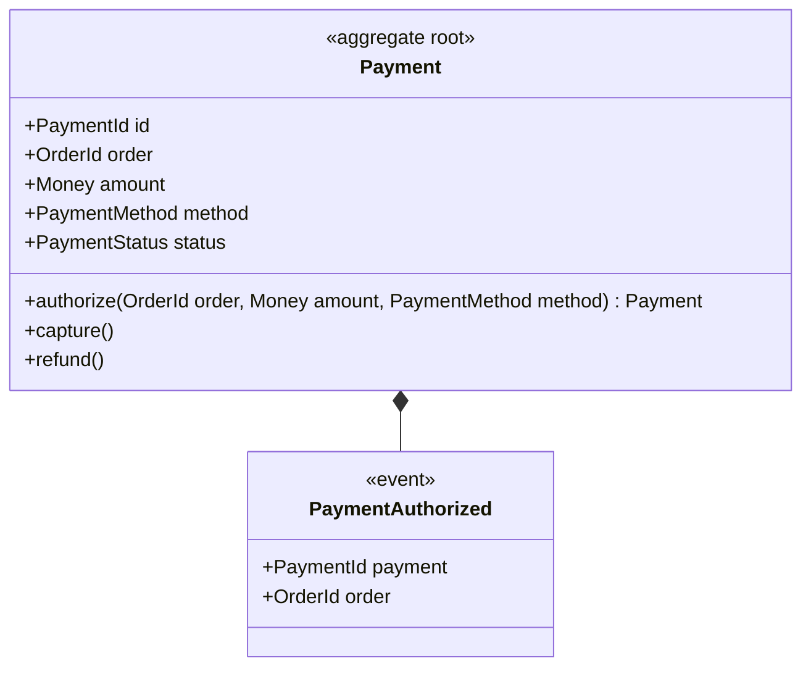
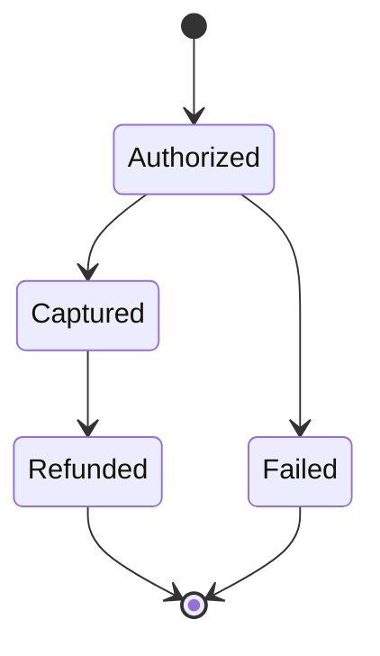
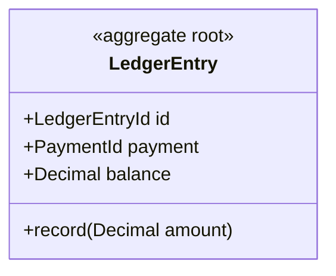

# Payments — version 1

Payments bounded context — authorizing and capturing money for orders.

## Aggregates

### Payment

The payment aggregate.

**Root entity:** `Payment` (identified by `PaymentId`)

#### Domain Events

**`PaymentAuthorized`**

Raised when a payment is authorized (R6/R8).

| Field | Type | Description |
| --- | --- | --- |
| payment | `PaymentId` |  |
| order | `OrderId` |  |

#### Lifecycle

| From | To | Guard |
| --- | --- | --- |
| `Authorized` | `Captured` |  |
| `Authorized` | `Failed` |  |
| `Captured` | `Refunded` |  |
| `Refunded` | _(terminal)_ | |
| `Failed` | _(terminal)_ | |

#### Commands

##### `capture()`

Capture an authorized payment.

**Preconditions:**
- only an authorized payment can be captured

**Effects:**
- `status -> Captured`

##### `refund()`

Refund a captured payment.

**Preconditions:**
- only a captured payment can be refunded

**Effects:**
- `status -> Refunded`

#### Factory Operations

##### `authorize(order: OrderId, amount: Money, method: PaymentMethod)`

R8 — authorize a payment for an order.

**Events:**
- `PaymentAuthorized(payment: id, order: order)`

### Ledger

A second aggregate — the revenue ledger. Two aggregates in one context means the generated IUnitOfWork exposes both repositories (R12.1).

**Root entity:** `LedgerEntry` (identified by `LedgerEntryId`)

#### Commands

##### `record(amount: Decimal)`

Post an amount to the ledger entry.

**Effects:**
- `balance -> amount`

## Domain Types

### Money — value object

| Field | Type | Description |
| --- | --- | --- |
| amount | `Decimal` |  |
| currency | `String` |  |

**Business rules**
- an amount cannot be negative

### PaymentReceipt — value object

| Field | Type | Description |
| --- | --- | --- |
| reference | `String` |  |
| amount | `Decimal` |  |

### PaymentMethod — enum

Values: Card, Transfer, Voucher

### PaymentStatus — enum

Values: Authorized, Captured, Refunded, Failed

## Events

### Domain Events

#### `PaymentCaptured`

Recorded when a payment is captured. Triggers the ledger-posting policy.

| Field | Type | Description |
| --- | --- | --- |
| payment | `PaymentId` |  |
| capturedAmount | `Decimal` |  |

## Policies

_When a domain event occurs, trigger a reaction on another aggregate._

### `PostToLedger` — when `PaymentCaptured`

Reaction: `Ledger.record(amount: capturedAmount)`
