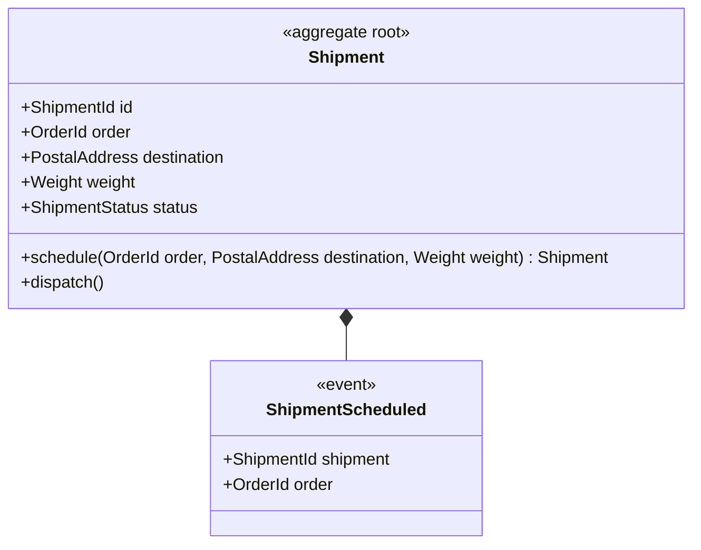
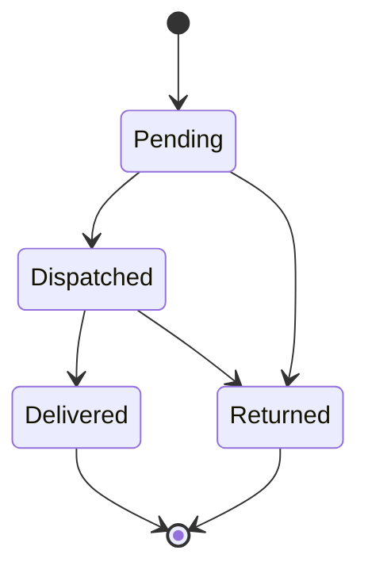

# Shipping — version 1

Shipping bounded context — getting orders to customers.

## Aggregates

### Shipment

**Root entity:** `Shipment` (identified by `ShipmentId`)

#### Domain Events

**`ShipmentScheduled`**

Raised when a shipment is scheduled (R6/R8).

| Field | Type | Description |
| --- | --- | --- |
| shipment | `ShipmentId` |  |
| order | `OrderId` |  |

#### Lifecycle

| From | To | Guard |
| --- | --- | --- |
| `Pending` | `Dispatched` |  |
| `Pending` | `Returned` |  |
| `Dispatched` | `Delivered` |  |
| `Dispatched` | `Returned` |  |
| `Delivered` | _(terminal)_ | |
| `Returned` | _(terminal)_ | |

#### Commands

##### `dispatch()`

R5 — advance a pending shipment onto a courier.

**Preconditions:**
- only a pending shipment can be dispatched

**Effects:**
- `status -> Dispatched`

#### Factory Operations

##### `schedule(order: OrderId, destination: PostalAddress, weight: Weight)`

R8 — schedule a shipment for an order. The same-named parameters auto-bind the required fields; `status` defaults to Pending.

**Events:**
- `ShipmentScheduled(shipment: id, order: order)`

## Domain Types

### ShipmentStatus — enum

Values: Pending, Dispatched, Delivered, Returned
