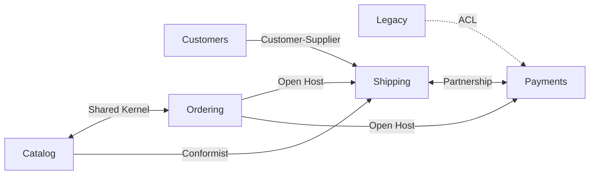

# Context Map

The strategic relationships between the bounded contexts of this domain.

## Shared Kernels

- **Catalog & Ordering** — shared types: `Currency`

## Anti-Corruption Layers

- **Legacy -> Payments**
  - `Legacy.GatewayResult` -> `Payments.PaymentReceipt`

## Relationships

- `Catalog <-> Ordering` — Shared Kernel
- `Catalog -> Shipping` — Conformist
- `Customers -> Shipping` — Customer-Supplier
- `Ordering -> Shipping` — Open Host
- `Ordering -> Payments` — Open Host
- `Shipping <-> Payments` — Partnership
- `Legacy -> Payments` — ACL
