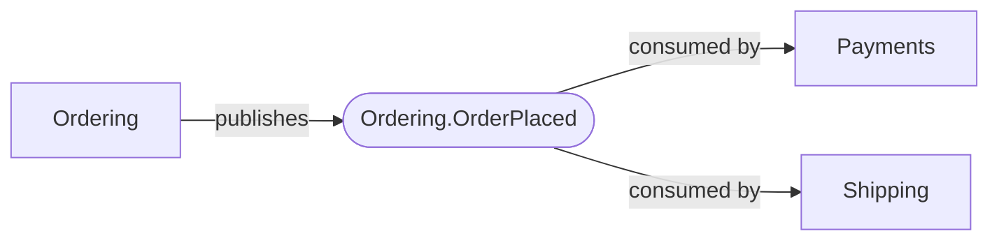

# Integration Events

The cross-context published-language flows: who emits each integration event and who consumes it.

## Event Schemas

### Ordering.OrderPlaced

Announced to the rest of the system when an order is placed (R14.3). An integration event is a *published language* — its fields stay primitive (ids/scalars), never leaking internal value objects.

| Field | Type | Description |
| --- | --- | --- |
| orderId | `OrderId` |  |
| customer | `CustomerId` |  |
| total | `Decimal` |  |
| placedAt | `Instant` |  |
