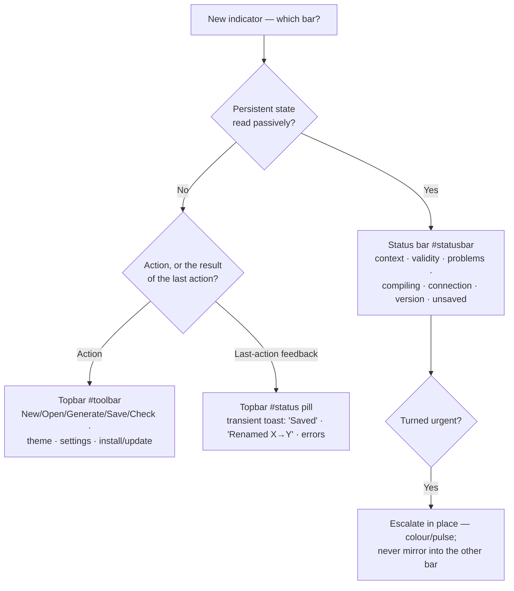

# Shell bars: the single-home contract

Koine Studio's shell has two horizontal chrome strips:

- the **topbar** — `<header id="toolbar">`
- the **bottom status bar** — `<footer id="statusbar">`

Over many incremental features (#109 unsaved-work, #146 context breadcrumb, #516 compiling indicator)
state indicators were each placed in whichever bar was convenient at the time, with no governing rule.
The result was that a user asking the four canonical questions — *is it busy / broken / unsaved /
connected?* — had no consistent place to look, and contributors kept re-litigating where a new
indicator belongs. A de-dup pass once nearly deleted the topbar `#status` pill thinking it duplicated
the status bar's `#sb-connection` — it does not; they are deliberately decoupled (see below).

This document is the **single-home contract** that prevents that drift (#756). It is enforced by the
structural guard `src/shell/shellBarsContract.test.ts`.

## The rule

> **Status bar `#statusbar`** owns *persistent ambient state* — facts you read passively, glanceable
> at any moment.
>
> **Topbar `#toolbar`** owns *actions* and *transient action-feedback* — things you do, and the toast
> reporting the result of the last thing you did.
>
> **One home per fact. Nothing is mirrored across both bars.** When a persistent state turns urgent it
> escalates *in place* (colour / pulse), never by mirroring into the other bar.

### Status bar — persistent ambient state

| Element | Fact |
|---|---|
| `#sb-context` | the active bounded context |
| `#sb-validity` | model validity (errors in the active file) |
| `#sb-problems-host` | workspace-wide problems rollup (`WorkspaceProblemsBadge`) |
| `#sb-compiling-host` | busy / compiling (`CompilingIndicator`, debounced) |
| `#sb-connection` | language-service connection — `Connecting… → Local → Offline` |
| `#sb-version` | the build version |
| `#unsaved-indicator` | unsaved work — a clickable "N unsaved" pill that triggers Save-all |

`#sb-connection` is the **sole connection indicator**. It is driven by `setConnection(state)` over the
LSP lifecycle (boots `Connecting…`, flips to `Local` on the first server push, `Offline` on a server
exit) — see `src/shell/editorSession.tsx`.

The `#unsaved-indicator` is a *persistent* state (open files have unsaved changes until you save), kept
**actionable** by being a clickable Save-all button — that is why a standing state lives here rather
than as a transient toast. It was relocated into the status bar from the toolbar by the shell calm-pass
work; its placement is exercised by the unsaved-work suites, so the structural guard does not re-assert
it (to avoid coupling the contract guard to that move).

### Topbar — actions + transient action-feedback

- The **model-action buttons**: New / Open / Generate / Save / Check (`#btn-new`, `#btn-open-folder`,
  `#btn-generate-project`, `#btn-save-project`, `#btn-check`), plus history controls.
- **Theme / settings / command-palette**, and the install / update affordances.
- The **`#status` action-feedback pill** — the *transient last-action toast*: `Saved ✓`,
  `Renamed X → Y`, `link copied ✓`, and error toasts. It is driven by `setStatus(text, kind)` where
  `kind ∈ { 'green', 'error' }`.

**`#status` is not a connection indicator.** It boots empty (hidden via `#status:empty`) and only ever
reports the result of an action. It carries `role="status" aria-live="polite"` so action feedback is
announced to assistive tech — but it is deliberately decoupled from `setConnection`: a warning, an
error toast, or a model with diagnostics must never make the connection read "Offline", and the pill
must never seed "connecting…" (which would impersonate `#sb-connection` for the first frame — the exact
overlap #756 removed).

## Where does a new indicator go?

## The four canonical questions

| Question | Home |
|---|---|
| Is it **connected**? | `#sb-connection` (status bar) — single home |
| Is it **busy**? | `#sb-compiling-host` (status bar) |
| Is it **broken**? | `#sb-validity` + `#sb-problems-host` (status bar) |
| Is there **unsaved** work? | `#unsaved-indicator` (status bar) |

All four are persistent ambient state → all four live in the status bar. The topbar answers a different
question — *what did my last action do?* — via the `#status` pill.

## Enforcement

`src/shell/shellBarsContract.test.ts` reads the real `index.html` and asserts each ambient-state item is
a descendant of `#statusbar` (and not also `#toolbar`), the actions and `#status` pill live in
`#toolbar` (and not also `#statusbar`), and that connection text has exactly one home (`#sb-connection`).
A misplacement, a mirror, or a `#status` pill that starts reading as connection fails the test.
