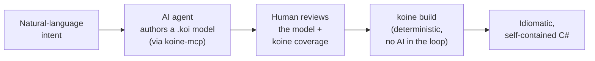

The cheapest, most reliable code an AI writes is the code it **doesn't** write. Koine turns a
bounded context's `.koi` model into the **specification** — and the compiler, not the model, writes
the implementation. The agent's job stops at the spec; everything downstream is a deterministic build.

## The workflow



1. **Intent** — a person describes the domain in plain language ("an order can't be placed empty;
   money is never negative; a customer has a validated email").
2. **Authoring** — an AI agent translates that intent into a `.koi` model using the
   [MCP server](/Koine/guides/mcp-server/): it learns the language from `koine_reference` /
   `koine_examples`, drafts the model, and runs `koine_validate` until the model is `ok`.
3. **Review** — a human reads the **model**, not thousands of lines of generated code, and checks a
   [`koine coverage`](/Koine/guides/cli/) report that proves every declared type made it into the
   output. The model *is* the diff.
4. **Build** — `koine build` compiles the reviewed model to idiomatic, self-contained C#
   **deterministically, with no AI in the loop**. The same input always yields byte-identical output.

The spec is the artefact under review and under version control. The implementation is regenerated on
demand and is never hand-edited.

## Why this is cheaper

The usual "AI writes the feature" loop is a **generate → test → fix** cycle: the model emits code,
something fails, the failure is fed back, the model patches, and round and round — every lap burns
tokens and wall-clock, and the loop can stall on its own mistakes.

Model-as-spec collapses that to **one MCP round-trip plus a deterministic compile**. The agent writes
a model that's a fraction of the size of the code it stands in for, validates it once, and hands off.
Producing the implementation — value objects, entities, aggregates, invariants, commands, events,
repositories, the CQRS layer — is a `koine build`, which has **zero token cost** and runs in
milliseconds. The expensive, stochastic part of the pipeline shrinks to authoring a small spec; the
large, mechanical part becomes a compiler.

## Why completeness is guaranteed, not hoped-for

When an AI writes the implementation directly, completeness is a *hope*: maybe every rule you
described made it into the code, maybe one was silently dropped, and you only find out in production.

Koine makes completeness a **property of the pipeline**. The compiler always emits **every** declared
type — every value object, entity, aggregate, invariant, command, event, and repository in the model
is present in the output by construction. Nothing the model declares is left to the emitter's
discretion.

And you don't have to take that on faith. **`koine coverage`** (and the matching `koine_coverage`
MCP tool) walks the emitted files and proves **declared == emitted**: it reports, per context and per
kind, how many declared types the target actually produced, and exits non-zero if any declared type is
missing — so it doubles as a CI gate. A green coverage report is a machine-checked guarantee that the
reviewed spec and the shipped code agree.

## A worked example

Start with a tiny model — the `billing` starter:

```koine
context Billing {

  value Money {
    amount: Decimal
    currency: Currency
    invariant amount >= 0        "a monetary amount cannot be negative"
  }

  enum Currency { EUR, USD, GBP }

  value Email {
    raw: String
    invariant raw matches /^[^@]+@[^@]+$/   "invalid email address"
  }

  entity Customer identified by CustomerId {
    name: String
    email: Email
  }

  aggregate Order root Order {

    enum OrderStatus { Draft, Placed, Shipped, Cancelled }

    value OrderLine {
      product:   ProductId
      quantity:  Int
      unitPrice: Money
      subtotal:  Money = unitPrice * quantity
    }

    entity Order identified by OrderId {
      customer: CustomerId
      lines:    List<OrderLine>
      status:   OrderStatus = Draft
      invariant status == Draft when lines.isEmpty
    }
  }
}
```

Prove the target covers every declared type:

```bash
koine coverage billing.koi
```

```
Coverage for csharp: 8/8 types covered

Billing
  aggregate: 1/1
  entity: 2/2
  enum: 2/2
  value: 3/3

✅ All declared types are covered by the csharp target.
```

The ✅ is the gate: eight declared types in the model, eight emitted. Now produce the code — no AI,
fully deterministic:

```bash
koine build billing.koi --target csharp --out ./generated
```

The same model, the same output, every time. Add `--json` to `koine coverage` for a stable
machine-readable report you can assert on in CI.

## Scope

This guide is about a **methodology and the tools that already ship in the box** — the `.koi` model,
the [MCP server](/Koine/guides/mcp-server/), `koine coverage`, and `koine build`. There is **no
hosted or paid service** involved: everything here runs locally from the CLI and the MCP server you
register yourself. Where this leads as a product is out of scope for the documentation.
